  - فصل اول :clipboard:

  - قسمت اول [TailwindCss چیست؟ ](#چیست؟-tailwindCss)
  - قسمت دوم [پیش نیاز های TialwindCss ](#پیش-نیاز-های-TialwindCss)

  - قسمت سوم [Utility ها در تلویند چی هستند ](#ها-در-تلویند-چی-هستند-Utility)

  - قسمت چهارم [آیا تلویند بازدهی سایت رو کم میکنه؟! ](#آیا-تلویند-بازدهی-سایت-رو-کم-میکنه؟!)

  - قسمت پنجم [Tailwind Css در چه وب سایت های استفاده شده ](#Tailwind-Css-در-چه-وب-سایت-های-استفاده-شده)

- فصل دوم :clipboard:

  - قسمت اول [توضیح کلی و نحوه این فصل](#توضیح-کلی-و-نحوه-این-فصل)

  - قسمت دوم [آماده سازی کد ادیتور و اکسیشن های مورد نیاز](#آماده-سازی-کد-ادیتور-و-اکسیشن-های-مورد-نیاز)
  - قسمت سوم [نصب تلویند با استفاده از Tailwind CLI](#نصب-تلویند-با-استفاده-از-Tailwind-CLI)
  - قسمت چهارم [کانفیگ کردن prettir با تلویند](#کانفیگ-کردن-prettir-با-تلویند)
  - قسمت پنجم [نصب تلویند روی فریم ورک های مختلف](#نصب-تلویند-روی-فریم-ورک-های-مختلف)
  
- فصل سوم 
  - قسمت اول [Utility های فونت](#Utility-های-فونت)
  - قسمت دوم [نحوه کلی کارکرد Layer ها و Apply در تلویند](#نحوه-کلی-کارکرد-Layerها-و-Apply-درتلویند)
  - قسمت سوم [نحوه کلی کارکرد فایل Config در تلویند](#نحوه-کلی-کارکرد-فایل-Config-در-تلویند)
  - قسمت سوم [نحوه کلی کارکرد فایل Config در تلویند](#نحوه-کلی-کارکرد-فایل-Config-در-تلویند)
  - قسمت پنجم [یوتلیلیتی Font Size](#ایوتلیلیتی-Font-Size)
  - قسمت ششم [یوتلیلیتی Font Size](#برسی-روش-افزودن-مقادیر-دلخواه-برای-یوتیلیتی-ها-واضافه-کردن-مقادیر-دلخواه-Font-Size)
  - قسمت هفتم [آشنایی با مقادیر Arbitrary برای یوتیلیتی های تلویند](#آشنایی-با-مقادیر-Arbitrary-برای-یوتیلیتی-های-تلویند)
  - قسمت هشتم [یوتیلیتی های مربوط به Font-style و Font weight](#یوتیلیتی-های-مربوط-به-Font-style-و-Font-weight)
  - قسمت نهم [یوتیلیتی Line Clamp برای مشخص کردن حداکثر تعداد خطوط قابل مشاهده](#یوتیلیتی-Line-Clamp-برای-مشخص-کردن-حداکثر-تعداد-خطوط-قابل-مشاهده)
  - قسمت دهم [یوتیلیتی Line Height](#یوتیلیتی-Line-Height)
  - قسمت یازدهم [یوتیلیتی Text Align](#یوتیلیتی-Text-Align)
  - قسمت دوازدهم [یوتیلیتی text color](#یوتیلیتی-text-color)
  - قسمت سیزدهم [برسی پالت و رنگ های دیفالت تلویند و افزودن پالت رنگی دلخواه](#برسی-پالت-و-رنگ-های-دیفالت-تلویند-و-افزودن-پالت-رنگی-دلخواه)
  - قسمت چهاردهم [استفاده از یوتیلیتی opacity و اعمال آن به رنگ ها](#باستفاده-از-یوتیلیتی-opacity-و-اعمال-آن-به-رنگ-ها)
  

    
  - قسمت پانزدهم بزودی ... :blush: :date:

---

<div align="center">
  
</div>

<br/>

فصل 1- معرفی

> # چیست؟ tailwindCss

_نوشته شده بر اساس دوره تلویندcss با امید بهاری فر سایت [سایت کدنایت](https://codenight.ir/courses)_

کلید یادگیری اینه که یک بار بعد دیدن دوره یا خواندن و یادگیری از حفظ یکبار و چند بار اموخته های خود را کد بزنید

تلویند فریم ورکی برای نوشتن سریع و ساده کد ها و استایل های css است.
تلویند راه حلی به شما میده که بتونیم استایل های css رو به عناصر html رو بدون اینکه از فایل html خارج بشیم اعمال کنیم.
در حالت کلی اگه با سی اس سی خالی بخوایم استایل دهی کنیم باید به عنصرمون یه ایدی یا کلاس بدیم و توی فایل سی اس اس مون اون رو انتخاب کنیم و بهش استایل بدیم هلا ممکنه برای انتخاب اسم clsss یا id درسته براش یه سری قواعد و اصولی رو ابداع کردن ولی باز هم این چالش رو به صفر نمیرسونه حتی گاهن ممکنه اون فایل سی اس اس شما خیلی طولانی شود و دیگه ندونید که از این اسم کلاس یا ایدی استفاده کردین قبلا یا خیر و اگه کلاس های هم نام یا استایل های مشابه داشته باشیم ممکنه تداخل ایجاد کنه و حتی کد های تکرار شده

```html
<div class="container">
  <!-- ... -->
</div>
```

```css
.container {
  background-color: red;
  display: flex;
  justify-content: center;
  height: 100vh;
}
```

###### فرایند استایل دهی سنتی با html , css

<br/>
<br/>

```html
<div class="flex justify-center bg-red-500 h-screen">
  <!-- ... -->
</div>
```

###### استفاده از tailwindCss

هموطور که میبینید برجای اینکه یه کلاس خاص یا ایدی براش درست کنیم و بعدن تو یه فایل سی اس اس دیگه تازه بیاییم بهش استایل هامونو اعمال کنیم اومدیم از کلاس های خاص خود تلویند استفاده کردیم این چهار تاکلاس که نوشتیم درواقع کلاس های خاص تلویند هستند یعنی تلویند این کلاس ها رو در اختیارمون قرار میده

تلویند همه پراپرتی های css به همراه مقادیر اونها رو در قالب کلاس های خاصی توی خودش تعریف کرده و در اختیار ما قرار داده

اینجا منضور تلویند رو متوجه شدیم اینکه توی سایت خودشونم گفته بودن دادن استایل ها بدون اینکه نیاز باشه از کد html خارج بشید.
تلویند برخلاف Bootstrap و MUI استایل و کامپوننت آماده ندارد!

همونطور که دیدیم تلویند فقط میاد نوشتن استایل های سی اس اس رو ساده تر میکنه یعنی همچنان لازمه شما استایل های خودتونو بنویسید . منتها اون شیوه نوشتن و ساده تر میشه اما بوتسترپ و متریال یو آی اینطوری نیستن اینا استایل های از پیش تعین شده و از پیش آماده دارن مثلا خودشون عناصر و استایل های فورم یا نوبار و ... رو دارند و اره شما تاحدودی میتونین اینا رو شخصی سازی کنید اما بیس کار توی اما توی تلویند اینطوری نیست تلونید گقتیم فقط میاد نوشتن کد های CSS رو ساده تر میکنه و عملا ساختار رو مجدد خودتون باید پیاده سازی کنید.

هالا مزیت این قضیه چیه؟
اینه که شما کاملا دستتون بازه به اندازه سی اس اس خام که هر استایلی که میخواید هر دیزاینی که میخواید هر چقدر پیچیده هر چقدر هم حرفه ای با استفاده از تلویند میتونین اون رو پیاده سازی کنید. که خب بوتسترپ و متریال یو ای خیلی جاها دست شما رو میبندند که خب همه اون سایتایی که با بوتسترپ ساخته شده اند یه پسزمینه مشترکی دارند چون بهم شبیه هستند استایل ها شون چون اماده هست و برای متریال یو ای هم به همین شکل
که همه سایت هایی که با تلونید ساخته شده اند همه باهم فرق دارند و باهم متفاوت هستند. چون دست دولوپر بازه

`این قضیه مربوط به برتری تلویند یا متریال یو ای یا بوتسترپ نیست بلکه کاربرد اینا باهم متفاوت است . مثلا یه زمانی هست که شما میخواید یه دیزاین پیچیده و خفنی رو درست کنید لازمه که دستتون باز باشه با پراپرتی های سی اس اس بازی کنید واینجور مواقع تلویند به کارمون میاد 
ولی یه زمانی هست که میخوایم خیلی سریع یه دیزانی رو جمع و جور کنیم که کارو رابندازه و  مثلا سایتمون یه دیزاین ساده میخواد بوتسترپ و متریال یو ای خیلی کاربردی ترن هر کدوم به جای خود.
`

---

> # پیش نیاز های TialwindCss

<br/>

<div align="center">
  

_Html , Css ضروری_

تسلط به زبان نشانه گزاری html ضروری و تسلط به css ضروری

</div>

<div align="center">
  
  

_JavaScrip , Npm مزیته اجباری نیست_

</div>

---

> # ها در تلویند چی هستند Utility

اینکه خود سایت تلویند هم میگه تلویند یه فریم ورک utility-first هست به چه معنی هست. و یوتیلیتی در اختیار کاربرش قرار میده و اجازه میده که ما از این utility های استفاده کنیم و با استفاده از این utility ها استایل خودمون رو به عناصر اعمال کنیم.

تلویند مجموعه ای از یوتیلیتی ها رو در اختیارمون قرار میده مثل کلاس های ریز که هرکدوم کاری انجام میدن و ما میتونیم دونه دونه این کلاس ها که ما بهش میگیم utility رو به عنصرمون بدیم و بتونیم اون استایل نهایی رو روش داشته باشیم .

خب شاید سوالی که به زهنتون برسه این باشه خب اگه همه اون استایل های مثل کلاس هستند چرا نیاییم اتربوت style رو بصورت انلاین بدیم به عناصر و اینطوری استایل ها مون رو اعمال کنیم

```html
<!-- inline style -->
<div style="display: flex; background-color: red;">...</div>
```

```html
<!-- utilitie class tailwindCss -->
<div class="bg-red-500 flex"></div>
```

<br/>

مهمترین دلیلی که این یوتیلیتی کلاس ها بر اینلاین استایل ها برتری داشته باشند اینه که شما در اینلان استایل ها نمیتونین به مدیاکویری ها دسترسی داشته باشید مدیا کوییری منضور همون دیزاین ریسپانسیو است از طریق انلاین استایل ها مقدور نیست اما تلویند طوری طراحی شده که شما میتونین این یوتیلیتی کلاس ها رو درحالت ریسپانسیو هم استفاده کنین
مورد بعدی شما در حالت اینلاین استایل ها نمیتونیم به hover , focuse و ... دستری داشته باشیم مثلا از طریق انلاین استایل نمیتونیم به حالت هاور یه دکمه استایل بدیم ولی باز هم تلویند فکر اینجاشم کرده و برای استایل دهی کردن در حالت هاورهم و سایر... هم سینتکسی داره
یه نکته دیگه شما اگه از انلاین استایل ها استفاده کنید نمیتونید که مثلا یه کد رنگی داخل یک متغیری تعریف کنیم و بعد از اون اسمه متغیر استفاده کنید هر بار اگه خاستین یه کد رنگی بنویسد هربار باید اون رو تایپ کنین ولی خب تلویند این امکان رو به شما میده که یه سری مقادیر رو داخل یه سری متغیر تعریف کنید و دیگه مجبور نشید هر بار اون مقدار رو بصورت دستی تایپ کنیم بلکه بجاش از اسم اون متغیر استفاده کنیم که کارمون راحت تر بشه و بعدن هم اگه خاستیم بصورت کلی اون رنگ یا مقدار رو برای همه عوض کینم خیلی راحت تره
این بصورت کلی برتری یوتیلیتی کلاس ها بر انلاین استایل ها بود
Inline-style , utility-class

---

> # آیا تلویند بازدهی سایت رو کم میکنه؟!

ایا تلویند تاثیر منفی روی سایت میزاره یا مثلا سرعت سایت رو کم میکنه یه سرعت لود سایت رو کم میکنه؟ خیر

تلویند به هیج عنوان پرفورمنس سایت یا سرعت سایت رو کم نمیکنه بهرحال شاید شنیده یا دیده باشید هر پکیجی تاثیر منفی کمی روی پروژه میزاره و این طبیعی و مشخصه
ولی راجب تلویند اینطروی نیست چرا؟
اگه خاطرتون باشه ما از یوتیلیتی های تلویند چند صفحه قبل استفاده کردیم تلویند یه سری یوتیلیتی هایی رو به ما میده که با مجموعه اینا روی هر کدوم از عناصر سایتمون به اون استایل موردنظر میریسیم
هالا نکته ای که وجود داره تریکی که تلویند میزنه اینکه بعد از اینکه فرایند توسعه پروژه ما تموم شد زمانی که خاستیم نسخه نهایی رو استخراج کنیم تلویند تو اون مرحله میاد کل سورس کد اون قسمتی که براش مشخص میکنیم رو میاد اسکن میکنه و برسی میکنه و صرفن اون یوتیلیتی هایی که ما ازش استفاده کردیم رو تشخیص میده یعنی تشخیص میده که ما از کدوم یوتیلیتی ها استفاده کردیم و به عنوان خروجی خودش فقط و فقط یه استایل شیت شامل اون یوتیلیتی هایی که ما ازشون استفاده کردیم اریه میده یعنی تنها یادگاری تلونید روی پروژه هایی که از تلویند استفاده میشه توی خروجی نهایی یه استایل شیت کاملا بهینه از اون یوتیلیتی های تلویندی هست که کاربر ازش استفاده کرده و دیگه بقیه یوتیلیتی هایی که ازش استفاده نکردیم رو توی اون استایل شیتش نمیاره  
و این خروجی سبک و بهینه شده باعث میشه که تلویند هیچ تاثیر منفی روی پرفورمنس سایت نزاره و حتی این فایل استایل شیتی که تلویند تو خرجی بهون میده از استایل شیت روش سنتی که قبلا مینوشتیم خیلی وقتا بازدهی بیشتر و بهتری داره به این علت که اولا کد تکراری نداره و خب هرکدوم یوتیلیتی های داخلش هم چند باز مصرف هستن به همین دلیل نه تنها پرفورمنیس سایتمون رو بدتر نمیکنه بلکه ممکنه در برخی موارد بهنیه ترم است.

---

> # Tailwind Css در چه وب سایت های استفاده شده

<br/>

وب ساست open ai هوش مصنوعی چت جی پی تی.

<div align="center">
  
  
  Openai.com
</div>

<br/>

وب سایت دات نت که برای شرکت مایکروسافت است.

<div align="center">
  
  
  Dotnet.microsoft.com
</div>

<br/>

وب سایت next.js

<div align="center">
  
  
  nextjs.org/docs
  
</div>

<br/>

وب سایت کد نایت

<div align="center">
  
  
  codenight.ir
</div>

---

فصل دوم : نصب تلویند وآماده سازی محیط توسعه در فریم وک های مختلف

> # توضیح کلی و نحوه این فصل

توی این فصل اکستیشن ها و مواردی که توی کد ادیتور مون نیاز داریم میپردازیم ونصب میکنیم و اگه نرم افزاری روی کامپیوترمون لازم است نصب میکنیم. و درقدم بعدی تلویند رو به پروژه خودمون اضافه میکنیم.

نکته ای که هست ما توی طول این دوره تلویند رو روی html , css خالی نصب و کار میکنیم . اما اگه خودتون به فریم ورک های دیگه مثل react , next , nuxt ,… تسلط دارید اموزش نصب تلویند روی اون ها هم هست توی داکیومیشن اصلی تلویند و توی دوره
پس ما تلویند رو روی پروژه خالی html , css نصب میکنیم tailwind CLI رو نصب میکنیم .
البته که کارکرد تلویند روی css , html خالی با فریم ورک های js فرقی نداره فقط فرایند نصبشون یکم باهم فرق دارند
از طریق سایت خود تلویند قسمت داکیومیشن و قسمت نصب میتونین نصب تلویند و دستورات نصب روی فریم ورک های مختلف رو میتوینن نصب کنین
1- وارد وب سایت tailwindcss.com
2- از منوی بالا وارد بخش DOC بشین داکیومیشن
3- از منوی سمت چپ روی Getting Start بشن صفحه ای که براتون میاد هم یه منو داره روی Framework Guids بشن و لیست لایبری ها و کتاب خانه ها

https://tailwindcss.com/docs/installation/framework-guides

<div align="center">
  
  
  
</div>
---

> # آماده سازی کد ادیتور و اکسیشن های مورد نیاز

اکسیشن های کاربردی
Tailwind CSS IntelliSense
که خود تلویند اون رو برای vscode توسعه داده و پیشنهاد اینه که اگه از تلویند داخل پروژه تون استفاده میکنین این extensons رو نصب کنین که راحتر و سریعتر کد بزنین

 

کاری که این اسیشن برای ما انجام میده میاد یوتیلیتی های تلویند رو موقع کد نویسی برای ما پیشنهاد میکنه یعنی دیگه ما لازم نیست همه یوتیلیتی ها ی تلویند رو حفظ باشیم یه ذره شو که بنویسیم خودش کاملشو پیشنهاد میده

اکستیشن دوم prettier-Code formatter است


کاری که این اکستیشن انجام میده اینه که کد های شما رو مرتب میکنه و نتضم میده که کد های تلویندی و ساختار html , ….. رو هم منظم میکنه که کد های تر تمیز تری میکنه.
که با کلید های ترکیبی alt + shift + f عمل میکنه.

همچنین نرم افزاری که نیاز هست برای نصب و راهندازی تلویند نرم افزار


است nodeJs

---

> # نصب تلویند با استفاده از Tailwind CLI

ما وقتی میخوام تلویند رو به پروژه html , css خام خود نصب کنیم از tailwind css CLI استفاده میکنیم .
بعنی تنها راه مطلوب و درست حسابی استفاده از این تلویند سی اس ای است
خب ما وارد ادرس و وب سایت tailwindcss.com میشویم وارد بخش DOC میشیم و توی بخش installation روش نصب با استفاده از tailwind CLI رو نوشته

برای اینکه بخوایم tailwind cli  رو نصب کنیم  ابتدا لازمه که npm  رو وارد پروژه کنیم که بخاطر همین بود که در جلسه های اول اومدیم و نود جی اس رو نصب کردیم  npm رو که نصب کردیم پکیج هایی که نصب میکنیم تویه قسمت و یه بخش اسم هاشون است
وارد ترمینال و مسیر پروژه میشیم فرض کیند که یه پوشه به اسم tailwind-cli  رو داریم با ترمینال یا cmd  و یا getbash وارد اون مسیر پوشه ای که درست کردیم میشم و  npm  رو نصب میکنیم با دستور 
npm init 
که این دستور حاصل از اون نرم افزار نود جی اس است که جلسه های پیش نصب کردیم اون این دستورات  npm  رو برای ما باز میکنه وقتی این دستور رو زدیم خود نود جی اس شروع به افزودن npm  به پروژه یا پوشه ما میکنه
البته موقع نصب  npm یه سری سوالات ازمون میپرسه که اونا رو رد میکنیم مثل اسم پروژه و ورژنش چیه توضیحات و ... اسم نویسنده پروژه ویه سری سولات
ها لا یه فایل به اسم و پسوند pacage.json   به پوشه ای که ساختیم اضافه میشه 
هالا ما هر پکیج و یا کتاب خانه ای با  npm  نصب کنیم اسمش و ورژن و اطلاعاتش میاد تو این فایل 

خب هالا بریم که تلویند سی ال ای رو نصب کنیم با  npm 
```
npm install -D tailwindcss 
```
وقتی که این دستور رو بزنیم یه فولدر node_modules  اضافه میشه که وابستگی های پروژه تلویندی ما هست و یه فایل pacage-lock.json  هم اضافه میشه  و همجنین داخل اون فایل pakage.json  مون هم یه قسمت "devDependencies" که داخلش نوشته شده   "3.3.7":"tailwindcss" اسم پکیجی که نصب کردیم و ورژن اون هست . 


پس اینطوری شد که یه فایل css  توی مسیر روت پروژه به عنوان فایل  style.css ورودی تلویندی داریم و یه فایل style.css هم برای خروجی استایل های یوتیلیتی خروجی تلویند داریم که مثلا تو فولدر public میایم یه پوشه درست میکنیم مثلا به اسم dist    ویعنی فایل های نهایی رو اونجا قرار میدیم و این قایل style.css  خروجی تلویندی رو هم اونجا قرار میدیم.


حلا کاری که انجام میشه اینه که ما توی فایل  ``` index.html ``` مون برای عناصر هر یوتیلیتی که بنویسم تلویند میاد داخل فایل کانقیگیمون اون مسیر رو که مشخص کردیم اون فایل ```index.html``` رو یوتیلیتی ها رو اسکن میکنه  و درنهایت اون یوتیلیتی هایی که استفاده کردیم رو توی اون فایل خروجی  style.css مون مینویسه 
هلا بعدن که خواستیم مثلا این پروژه مون رو ببریم رو سرور این فایل های html  و اون ```style.css``` خروجی رو میبریم رو سرور و تمام 
هلا قبل از اینکه این کار رو انجام بدیم لازمه که توی استایل شیت ورودی تلویند لازمه که directives های تلویند رو اونجا اضافه کنیم که توی سایت هم نوشته 


اینا directives  های تلویند هستند تلویند استایل های مورد نیاز ورودی خودشو از طریق این دایریکتیو ها  بصورت خودکار میگیره  این صرفن ورودی تلویند هست تنها چیزی که برای مرورگر قابل درکه و مهمه ایون style.css خروجی که تو پوشه dist ساختیم هست و خودش خودکار میاد این ورودی ها رو تبدیل میکنه به یه چیزی که مرورگر بفهمه  واونا رو تو فایل خروجی میریزه
وتمام الان همه کانفیگ های مورد نیاز ما انجام شد و میتونیم فرایند تبدیل کردن  رو استارت بزنیم یعنی به تلویند بگیم تو از الان دیگه گوش برزنگ باش  و هر کدی هر یوتیلیتی که تو اون فایل index.htl نوشتیم رو  تو بیا اونایی که استفاده کردیم تو این فایل  ورودی style.css اونا رو بگیر و تو خروجی  style.css  درست کن هالا چطوری میتونیم این کارو انجام بدیم؟
```
 npx tailwindcss -i style.css -o public\dist\style.css –watch
```
این کامند چیکار میکنه  ```npx tailwindcss``` میگه تو بیا استارت بخور ```-i``` میگه به عنوان وردی این مسیر رو در نظر بگیرورودی ها اینه دایریکتیو ها تو اینه و ```-o``` خروجی ها 	یعنی خروجی کارتو بریز اینجا  و همچنین این فرایند رو 
--watch کن یعنی حواست باشه نگهدار این فرایند روهردفه که سورس کد تغیری کرد تو  بیا یه دور دیگه این کارو انجام بده یعنی این –watch به ما این امکان رو میده که بصورت لایو زنده هرتغیری که تو فایل ```index.html``` هرتغیری یا یوتیلیتی مینویسیم و اضافه میکنیم این دباره اجرا میشه و لازم نیست با هر تغیر و افزودن یوتیلیتی جدید دباره این دستور رو هی بزنیم .
خب با این دستور خروجی استایل شیت مون درست میشه .

وقتی اولین باز این دستور رو میزنیم 
```npx tailwindcss -i style.css -o public\dist\style.css –watch```

تو اون فایل خروجی استایل شیت حدودن 500 خط کد اضافه میشه که در واقع کد های پایه ای  کد های مربوط به استایل های بیسیک تلویند است که اینا رو اضافه میکنه تا من محیط توسعه م بهتر بشه  یه سری چیزا مثلا مارجین های دیفالت رو صفر کرده پدینگ های دیفالت رو صفر کرده  و.. 


خب هالا که مطمن شدیم و همه کانفیگا و فایل ها مونو درست کردیم و اماده شروع کار و استفاده از تلویند هستیم.
برای مثال اولین یوتیلیتی رو مینویسم که ببینیم تلویند درست کار میکنه یا نه 


بعدن با این یوتیلیتی ها اشنا میشیم این فقط یه مثال بود که ببنیم کار میکنه
خب میتونیم بجای اینکه هر بار موقع اجرا کردن یا وقتی پروژه رو کلا میبندیم و باز میکنیم هی این دستور رو بزنیم یه کاری کنیم که راحت تره 

برای اینکار کافیه وارد فایل pacage.json بشیم و داخل بخش "script"
میتونیم یه مثلا دستور ایجاد کنیم و یه اسم براش قرار بدیم 


---

> # کانفیگ کردن prettir با تلویند


توی این جلسه قراره که قبلا که اکستیشن  prettierرو نصب کردیم و فهمیدیم که مختص به فقط تلویند هم نیست بصورت کلی روی کد ادیتور ما نصب میشه و کد ها رو با زدن کامد کلید های ترکلیبی مرتب میکنه .
خب ما میدونیم که تلویند با استفاده از نوشتن یوتیلیتی هاش به عنوان کلاس  روی هر عنصر برای ما کار میکنه خب ما میدونیم که درحالت عادی یوتیلیتی های تلویند رو با هر ترتیبی که میخوایم برای عناصرمون بنویسم .
درست تره که اون یوتیلیتی هایی که دراینده هم بهاشون اشنا میشیم بر اساس یه نظم و ترتیبی باشن .
البته هیچ الزامی وجود نداره ولی خب کار درست تر و قشنگ تره که با یه نظمی به ترتیب نوشته بشه و خود سایت تلویند هم اون رو توصیه کرده

https://tailwindcss.com/blog/automatic-class-sorting-with-prettier#how-classes-are-sorted

که توی این لینک هم یهش اشاره کرده یه مقاله ای نوشته که بهتره یه نظمی رور رعایت کنیم که کد تمیز تر و اسولی تر و خوانا تری رو داشته باشیم .

ولی خب اگه ما خود مون هی حواسمون به این موضوع باشه و هی کدمون رو چک کنیم یکم اذیت کننده است که ایا این یوتیلیتی ها رو با نظم نوشتیم یا نه 

کاری که prettier در کنار تلویند برای ما انجام میده علاوه بر نظم دهی به عناصر مون  utility های مونم مرتب میکنه برای اینکار لازمه که یه کانفیگ و تلویند رو به  پلاگین  prettierبشناسونیم  تا این utility  ها رو هم مرتب کنه 
با کامند alt + shift + f  برای اینکار و کانفیگ کردن این قابلیت از طریق یه پلاگین که روی پلاگین prettier نصب میشه . یه نکته خود پلاگین prettier میتونه یه سری پلاگین های دیگه ای رو هم روش نصب کرد که هرکدوم از اونها قابلیت هایی جدید رو بهش اضافه کنند  وارد سایت تلویند میشیم 


که اگه روی on GitHub کلیک کنیم وارد یه اکنت گیت هاب میشیم
که لینکش اینه 

https://github.com/tailwindlabs/prettier-plugin-tailwindcss

اسمش pretteier-plugin-tailwindcss است 
و دستورات نصب و کانفیگ و توضیحالتش یکم پایین تر نوشته شده


```
npm install -D prettier prettier-plugin-tailwindcss
```

خب هالا این پلاگین روی اکستیشن prettier نصب شد و یه مرحله دیگه داریم  . بازمه که یه فایل با اسم prettier.config.js  درست کنیم رو مسیر روت پروژه
و داخل فایل prettier.config.js این کد رو قرار بدیم 

``` html
module.exports = {
  plugins: ['prettier-plugin-tailwindcss'],
}
```

و این تنظیمات رو داخلش بنویسم  و درواقع یه prettier  گفتیم که  تو بیا از پلاگین prettier-plugin-tailwindcss استفاده کن .


خب هالا میتونیم از این قایلیت های مرتب سازی کد ها المنت ها و یوتیلیتی های تلونیدی رو هم مرتب کنه و نظم بده .
یه مثال بزنیم:


خب هالا کلید های ترکیبی  ali+ shift + f رو میزنیم 


---

> # نصب تلویند روی فریم ورک های مختلف


ما میتونیم تلویند رو روی فریم ورک های مختلف نصب کنیم. برای درک این موضوع و یاد گیریش وارد وب سایت تلویند میشیم  وارد قسمت DOC  میشیم واز ناوبار قمست Getting Started  و Instalation

<div align="center">
  
  
</div>
روی هرکدوم که کلیک کنین روش های نصبش رو توضیحاتی داده مثلا ریکت رو یه توضیحات مختصر میدمیم درموردش

توی قدم اول بعد نصب ریکت با دستور 

```
npm install -D tailwindcss
```

```
npx taiwindcss init
```

میبینیم که فایل ` tailwind.config.js `  خودش درست شده و لازم نیست که بصورت دستی اون رو درست کنیم.
داخل اون فایل تلویند کانفیگ کانفیگ و مسیر خواندن و اسکن کردن فایل ها رو میزرایم


توی پروژه ریکتی چون فایل ها توی پوشه src هستند و همه کامپوننت هایی که درست میکنیم توی این پوشه هستند پس تنها جایی که لازمه ادرس بدیم همینجا هست وارد اون پوشه شده و گفته همه پوشه و فایل هایی که همه اونایی با پسوند های  js,jsx,ts,tsx  هستند رو اسکن کن  

مرحله بعد اضافه کردن directives  های  استایل شیت ورودی هست که توی پروژه ریکتی معمولا میازاریم تو همون فایل css نقطه شروع پروژه که فایل index.css است .


index.css
``` css
@tailwind base;
@tailwind components;
@tailwind utilities;
```

دیگه لازم نیست استایل شیت خروجی بسازیم یا نقطه ورود مسیرشو رو بنویسم کدوم فایل هست و نقطه خروجی کجا هست و... خود کتاب خانه ها این رو هندل میکننند
حالا اگه ریکت رو با روش creacte-react-app  درست کردیم با کامند npm start اون رو راهندازی میکنیم و چند utility مینویسیم  .
و کار میکنه .


---


> # Utility های فونت

فصل 3 - مفاهیم و utility  های پایه ای

<br/>

بصورت پیشفرض خود تلویند فقط سه تا utility  برای فونت ها داره و سه نوع فونت رو در اختیار ما قرار میده که درواقع همون فونت های دیفالت خود مرور گر هستند که توی پروژه های واقعی این سه utility فونت برای ما کاربرد ندارند چون شاید ما بخوایم فونت دلخواه خودمون رو داشته باشیم  و فونت های فارسی داشته باشیم	.

در طول این فصل یاد میگیریم که utility های دیفالت تلویند رو تغیر ویا افزایش بدیم واضافه کنیم 


که توی وب سایت تلویند هم قسمت Typogrophy و بخش Font Family هم این سه تا یوتیلیتی فونت ها رو نوشته  

https://tailwindcss.com/docs/font-family


| Class      | Properties |
| ----------- | ----------- |
| font-sans      | font-family: ui-sans-serif, system-ui, sans-serif, "Apple Color Emoji", "Segoe UI Emoji", "Segoe UI Symbol", "Noto Color Emoji";       |
| font-serif	   | font-family: ui-serif, Georgia, Cambria, "Times New Roman", Times, serif;        |
| font-mono	   | font-family: ui-monospace, SFMono-Regular, Menlo, Monaco, Consolas, "Liberation Mono", "Courier New", monospace;        |


---

> # نحوه کلی کارکرد Layer ها و Apply در تلویند

اینا مربوط به همون استایل شیت ورودی هستند . اگه خاطرتون باشه چندین بار اون استایل شیت ورودی تلویند و اون سه تا دایریکتیو (directives) اشاره کردیم


@tailwind base:


```css
@tailwind base;
@tailwind components;
@tailwind utilities;

```

که الان توش عمیق میشیم و داستانش چیه رو باهم برسی میکنیم و کلا این دایریکتیو ها(directives) چیه و چه مزیت و امکانی رو دراختیارمون قرار میدن.

اگه استایل شیت خروجی تلویند رو یه نگا بندازیم میبینیم که 500 و خورده ای خط کد هستش و این حاصل directive @tailwind base; است.
هلا این دایریکتیو base چیه؟  تلویند با قرار دادن این دایریکتیو base درواقع میاد همه استایل های  بیسیکی که برای خونثا کردن استایل های دیفالت مرور گر ها است رو  توی استایل شیت خروجی قرار میده . پس با نوشتن این @taiowind base; توی استایل شیت ورودی تلویندی مییاد یه سری استایل هایی رو برای غیرفعال کردن یا خنثا کردن داخل استایل شیت خروجی میزاره تا استایل های پیشفرض عناصر رو بگیره
@tialwind utilities : 
Directive utilites چیه و چیکار میکنه؟ زمانی که شما این دایریکتیو رو به پروژه فایل استایل شیت ورودی اضافه میکنید میگید همه یوتیلیتی های تلویند رو توی استایل شیت ورودی لود کن ولی زمانی که خاستی استایل شیت خروجی رو بسازی  بیا کدای منو اسکن کن مثلا اون فایل ها و پسوند هایی که براش مشخص کردیم که برای مثال فایل  index.html  و صرفن فقط اونایی که استفاده کرده بودم رو اونا رو فقط توی استایل شیت خروجی بزار 

@tailwind components :
این دایریکتیو در حالت عادی  و دیفلت خالیه
پس برای چی گزاشتن؟ ما میتونیم استایل های مورد نظر خودمون رو به هر کدوم  از دایریکتیو ها که میخوام اضافه کنیم  یعنی میتونیم بگیم تلویند زمانی که تو داری استایل های دایریکتو مثلا base رو دار اضافه میکنی  بیا این چند تا استایلی که من بهت میگمم اضافه کن  یا تلویند من میخوام یه سری یوتیلیتی جدید به پروژم میخوام اضافه کنم و بیا این یوتیلیتی هایی منم بشناس و با یوتیلیتی های خودت بشناس و درنطر بگیر 

البته هرکدوم از اینها از انها که میتونیم استایل های خودمون رو بهشون اضافه کنیم شرایط خودشون رو دارند و یه سری تفاوت هایی هم باهم دارند.

` برای اینکه شما بتونین موارد و استایل های مورد نظر خودتون رو به هرکدوم از این directive ها اضافه کنین لازمه که از سینتکس  @layer و اسم دایریکتیو. `

```css
@tailwind base;
@tailwind components;
@tailwind utilities;

@layer base {

}

@layer utilities {

}

@layer components {

}
```

داخل اینا هر قطعه کد و استایلی که داخل هر کدوم از اینها بنویسیم همزمان با اطلاعات  مربوط به هرکدوم از این دایریکتو ها داخل استایل شیت خروجی  تلویند قرار میگیره.

هالا فرقاشون باهم چیه؟
همه استایل هایی که شما داخل @layer base اضافه میکنیم تحت هر شرایطی داخل استایل شیت خروجی تلویند قرار میگیرند چه از ش استفاده کنیم چه نکنیم دقیقن مثل همون استایل های بیس تلونید 

استایل شیت ورودی دایریکتیو ها ی تلویند

```css
@tailwind base;
@tailwind components;
@tailwind utilities;

@layer base {
    div {
        display: inline-block;
    }
}

@layer utilities {

}

@layer components {

}
```

استایل شیت خروجی  تلویند


پس شما وقتی که میخواید یه سری استایل هایی رو به عناصر اصلی بدید مثل همه div  ها یا همه عناصر  img ها  یا یه همچین چیرایی میتونین از @layer base اسفتاده کنید دقت کنین که از کلاس ها و ایدی ها اینجا نمیتونیم اینجا بهشون استایل خودمونو بدیم . این layer فقط برای تگ ها است . پس استایل های پایه ای تگ ها رو میتونیم اینجا قرار بدیم.

شاید براتون سوال پیش باید که مثلا اگه اون استایل و سلتور ها رو برون از این layer ها بنویسم چی؟ خب این استایل ها اعمال میشن ولی دیگه تلونید نمیتونه روش کنترولی داشته باشه یه جورایی نمیتونه خدمات خودشو رواون استایل بهمون بده  هالا چه خدماتی؟ جلوتر بهاشون اشنا میشیم.

Layer بعدی  @layer utilites : 
هر استایلی که ما داخل این layer   قرار بدیم و بنویسم دقیقن مثل یک یوتیلیتی تلویندی خواهد بود و تلویند مثل یک یوتیلیتی خودش بهاش برخود میکنه  یعنی چی ؟  یعنی در قدم اول اون رو تو استایل شیت خروجی تلویند نمیزاره تا زمانی که ما ازش استفاده نکنیم. 


مثلا یکی از یوتیلیتی هایی که میخوایم به تلویند اضافه کنیم و تلویند اون رو نداره حذف اسکرول بار هستش

```css
@tailwind base;
@tailwind components;
@tailwind utilities;

@layer base {
    div {
        display: inline-block;
    }
}

@layer utilities {
    .hede-scrool::-webkit-scrollbar {
        display: none;
    }
    .hede-scrool {
        -ms-overflow-style: none;
        scrollbar-width: none;
    }
}

@layer components {

}
```
خب الان تونستیم این یوتیلیتی رو به تلونید اضافه کنیم و تلویند مثل یک یوتیلیتی بهاش برخورد میکنه و الان تو استایل شیت خروجی تلویند نیست مگر تا زمانی که ازش استفاده کنیم.


@layer components هم شبیه layer utilites است یعنی اگه که ازش استفاده نکرده باشین تو استایل شیت خروجی تلویند اون رو نمیاره ولی فرقش یا layer utilites چیه؟  این layer components معمولا برای  تعریف کردن کلاس هایی یا یوتیلیتی هایی است که شامل چند تا استایل پراپرتی است یعنی توی layer utilites ما هر چند تا کلاس یوتیلیتی که تعریف میکردیم شامل یک پراپرتی سی اس اس استایل بود اما تو layer components  ما میتونیم کلااس هایی رو تعریف کنیم که شامل چندین پراپرتی سی اس اس میشن و مثلا کجا استفاده میشن مثلا یه کلاسی تعریف کنیم که اون کلاس یا یوتیلیتی رو به هر عنصری دادیم اون عنصر هم بک گراند رنگ قرمز و هم یه بوردر ریدیوسی بگیره و مثلا هم یه بوردیر 1پیکسلی هم بگیره یه همچین جور جاهایی که میخواید چندیین استایل رو یکی کنیم   و درقالب یک کلاس یا یوتیلیتی ازش استفاده کنیم توی این layer components هم تا زمانی که ازش استفاده نکنیم تو استایل شیت خروجی تلویند قرار نمیگیره .


```css
@tailwind base;
@tailwind components;
@tailwind utilities;

@layer base {
    div {
        display: inline-block;
    }
}

@layer utilities {
    .hede-scrool::-webkit-scrollbar {
        display: none;
    }
    .hede-scrool {
        -ms-overflow-style: none;
        scrollbar-width: none;
    }
}

@layer components {
    .card {
        background-color: red;
        border: 1px;
        border-radius: 10px;
    }
}
```

همونطور که دیدیم چند استایل رو تو یه کلاس یا یوتیلیتی نوشتیم .
التبه که داخل layer components هم میشه  که یه استایل رو نوشت و بهمون گیر نمیده ولی معمولا همنطور که توضیح دادیم چنیدن استایل رو مینویسیم 

یه نکته مهم : اون کلاس یا یوتیلیتی که توی layer components  مینوسیم اولویت کمتری دارن به نسبت layer ustilites  برای مثال اگه شما background-color : red ; رو داخل یه کلاس به اسم  .red توی layer components بنویسیم و توی layer utilites  هم یه کلاس به اسم مثلا .blue داشته باشیم و توش نوشته باشیم background-color: blue و هردو کلاس ها رو یعنی blue , red رو بدیم به یه عنصر مال layer utilites که رنگ blue هست اعمال میشه در نهایت. چون اولیوت بیشتری داره .

```css
@layer utilities {
    .blue {
        background-color: blue;
    }
}

@layer components {
    .red {
        background-color: red;
    }
}
```


```  پس ولویت استایل هایی که تو layer utilites قرار میگیرن از اولویت استایل هایی که تو layer components  قرار میگیرن بیشتره و همچنین اولویت استایل هایی که تو layer base قرار میگیرند از اولویت استایل های layer utilites بیشتره  ```


Apply
Applay  چیه و چیکار میکنه؟ میاد میگه که اقا تو اگر که خاستی میتونی داخل این استایل شیت ورودی تلویندت بجای اینکه دستی استایل ها  و پراپرتی های سی اس اس  رو بنویسی  میتونی از یوتیلیتی های خود تلویند استفاده کنی 

```css
@tailwind base;
@tailwind components;
@tailwind utilities;

@layer base {

}

@layer utilities {
    .blue {
        background-color: blue;
    }
}

@layer components {
    .red {
        @apply bg-red-500 rounded-sm
    }
}
```


پس شما اگه خاستین داخل layer ها تون بجای دستی نوشتن پراپرتی های css میتونین از @apply استفاده کنین .

---

> #  نحوه کلی کارکرد فایل Config در تلویند


قبلا برسی کردیم که هرپروژه ای که از تلویند استفاده میکنه یه فایل `tailwind.config.js` داره که تنظیمات کلی تلویند داخل اون انجام میشه

اولین کاربردش رو اگه خاطرتون باشه یادگرفتیم اون قسمت "content"  اونجایی بود که ما میومدیم و اون فایل ها و پسوند هایی رو مینویسم تا اونا رو اسکن کنه و یوتیلیتی هایی که تو این فایل ها و فولدر ها استفاده کردیم رو در بیاره و استایل شیت خروجی شو بسازه 


<br/>


> [!WARNING]
> __*این فایل کانفیگه علاوه بر این کاربرد های دیگه ای رو هم داره*__
__*بصورت کلی این فایل کانفیگ برای کانفیگوریشن و تغیر دادن کانفیگ ها و مقدار و خود یوتیلیتی های دیفالت تلویند است.*__
__*بعنی اگه یه یوتیلیتی توی تلویند است که شما میخواید مقدار اون رو اوررایت تغیر دهید  حتی اگه خاستین یوتیلیتی های جدیدی رو هم اضافه کنین  یا درواقع مقدار جدیدی برای یوتیلیتی های تلونید اضافه کنین باز هم میتونیم از این فایل استفاده کنیم!*__

> [!NOTE]
> دقت کنین اگه یوتیلیتی های کاملا جدیدی خاستیم اضافه کنیم از اون توضیحاتی که جلسه پیش دادیم فایل ورودی  و @layer های ورودی  استفاده میکنیم  .  اما یه زمانی هست  ما میخوایم یه سری مقادیر جدید برای یوتیلیتی های تلویند تعریف کنیم مثلا**  ما یه یوتیلیتی  bg-red-500 داریم وخب تلویند حلاوه بر تیف 500 از 50 تا 950 رو داره مثلا شاید ما بخوایم یه تیف 1000 یعنی به این شکل bg-red-1000 اضافه کنیم یا اصلا یه چیز دیگه  bg-red-mamad اضافه کنیم باید بریم سراغ فایل کانفیگ تلوندمون علاوه بر اون مثلا اگه خاستیم همون تیف رنگی 500 رو مقدار رنگشو تغیر بدیم به رنگ دیگه ای باز هم باید بریم سراغ کانفیگ تلوند مون واین قضیه فقط صرفن برای رنگ نیست برای بوردیر ردیوس ها و... همه موارد .


یه مثال بزنیم مثلا میخوایم مقدار تیف رنگی bg-red-500 روتغیر بدیم رنگی که داره به رنگ دیگه ای 
مربوط به رنگ های است و مینویسیم colors و رنگ قرمز هست و اون طیف رنگی 500 و مقدارش رو میزاریم که تغیر یا اصطلاحن اوررایت بشه


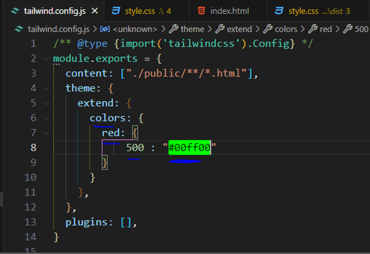

الان دیگه هرکجا ازاینbg-red-500 که قرمز بود دیگه سبزمیشه
هلااگه خاستیم یه طیف جدیدی رو درست کنیم     

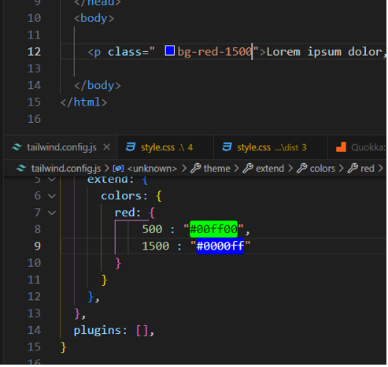

یا اینکه بجای 1500 یه اسم بزاریم مثلا mamad

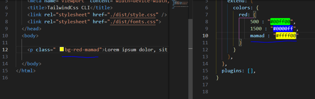 


یااینکه میتونیم رنگای جدیدی رو اضافه کنیم


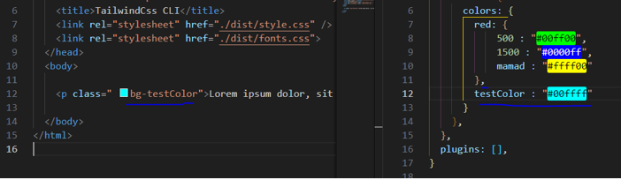


البته برای چیزای دیگه هم داره مثلا فاصله ها و.... که در اینده بهاش اشنا میشیم  که نحوه کلی کارکردش به همین شکله.

---


> # اضافه کردن فونت دلخواه به پروژه  با دو روش config  و base Layer

همونطور که در جلسه قبل گقتیم اون سه یوتیلیی های فونت فمیلی هایی که خود تلویند در اختیار مون میزاره خیلی قشنگ نیستن و برای متن های انگلیسی هستند.
و خب لازمه که ما فونت های دلخواه خودمون رو اضافه کنیم
فونت هایی که لازم داریم رو دانلود میکنیم که ما در این مثال از این فونت ها استفاده کردیم. به این ادرس اقای راستیکردار میتونین توگیت هاب سر بزنین و اونا رو دانلود کنین

https://rastikerdar.github.io


میتونیم یکی رو دانلود کنیم از فونت ها 
فونتی که دانلود کردیم ممکنه وزن های مختلفی داشته باشه یه پوشه به اسم fonts درست میکنیم و اون فونت ها و وزن ها شو اونجا قرار میدیم
 ویه فایل   fonts.css هم درست میکنیم که این فونت هایی که داریم رو به سی اس اس  معرفی کنیم  و اون هم به سند index.html لینک میکنیم که 
فونت ها رو بتونه بخونه


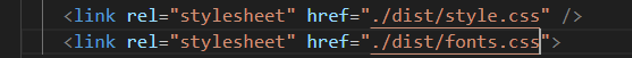

اولی لینک دهی استایل شیت خروجی تلویند است و دومی اون فایل سی اس اس  است که فونت ها رو توش معرفی کردیم 

fonts.css
```css
@font-face {
    font-family: Vazirmatn RD;
    src: url('../fonts/Vazirmatn-RD-Thin.woff2') format('woff2');
    font-weight: 100;
    font-style: normal;
    font-display: swap;
  }
  
  @font-face {
    font-family: Vazirmatn RD;
    src: url('../fonts/Vazirmatn-RD-ExtraLight.woff2') format('woff2');
    font-weight: 200;
    font-style: normal;
    font-display: swap;
  }
  
  @font-face {
    font-family: Vazirmatn RD;
    src: url('../fonts/Vazirmatn-RD-Light.woff2') format('woff2');
    font-weight: 300;
    font-style: normal;
    font-display: swap;
  }
  
  @font-face {
    font-family: Vazirmatn RD;
    src: url('../fonts/Vazirmatn-RD-Regular.woff2') format('woff2');
    font-weight: 400;
    font-style: normal;
    font-display: swap;
  }
  
  @font-face {
    font-family: Vazirmatn RD;
    src: url('../fonts/Vazirmatn-RD-Medium.woff2') format('woff2');
    font-weight: 500;
    font-style: normal;
    font-display: swap;
  }
  
  @font-face {
    font-family: Vazirmatn RD;
    src: url('../fonts/Vazirmatn-RD-SemiBold.woff2') format('woff2');
    font-weight: 600;
    font-style: normal;
    font-display: swap;
  }
  
  @font-face {
    font-family: Vazirmatn RD;
    src: url('../fonts/Vazirmatn-RD-Bold.woff2') format('woff2');
    font-weight: 700;
    font-style: normal;
    font-display: swap;
  }
  
  @font-face {
    font-family: Vazirmatn RD;
    src: url('../fonts/Vazirmatn-RD-ExtraBold.woff2') format('woff2');
    font-weight: 800;
    font-style: normal;
    font-display: swap;
  }
  
  @font-face {
    font-family: Vazirmatn RD;
    src: url('../fonts/Vazirmatn-RD-Black.woff2') format('woff2');
    font-weight: 900;
    font-style: normal;
    font-display: swap;
  }
  ```

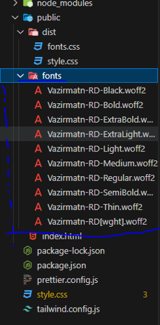

هالا میخواییم فونت ها مون رو به تلویند معرفی کنیم و مثل یوتیلیتی های تلویند ازشون استفاده کنیم که سه  روش فونت مون رو به تلیوند معرفی میکینم
همونطور که گفتیم خود تلویند سه فونت پییشفرض رو داره که یوتیلیتی فونت font-sans رو چه بنویسیم چه ننویسیم فونت پیشفرض است و تغیری نمیکنه روش اول میتونیم با استفاده از فایل کانفیگ مقدارش رو برابر اون فونت وزیری که خودمون داریم و دانلود کردیم بزاریم این یه روش یعنی این فونت وزیرمیشه فونت پیشفرض همه متن ها یعنی بجای فونت font-sans که خودش مقدارپیشفرض هست رو مقدارشو اوررایت کنیم به فونت خودمون 

وارد فایل tailwind.config.js میشیم و دخل extend کلمه fontFamily رو مینویسم و اسم sans رو مینویسم قبلا خودتلویند این اسم و مقدار فونت رو داره ولی میایم مقدارشو اوررایت تغیر میدیم به فونت خودمون و اسم فونتی که دانلود کردیم که Vazirmatn RD بود رو مینویسیم

tailwind.config.js
```js
/** @type {import('tailwindcss').Config} */
const colors = require('tailwindcss/colors')

module.exports = {
  content: ["./public/**/*.html"],
  theme: {
    extend: {
      fontFamily : {
        sans : " Vazirmatn RD"
      }

    },
  },
  plugins: [],
}
```

index.html
```html
  <body dir="rtl">
    <p class="font-sans">سلام دنیا</p>
  </body>
```
از اونجا که فونت پیشفرض مرور و سند مون همون فونت دیفالت sans هست  و ما اومدیم اون رو اوررایت تغیر یا بازنویسی کردیم به این فونت vazerMatn RD بخاطر همین این `"class="font-sans`  رو چه بنویسم چه ننویسم اعمال میشه روش این فونت چون بصورت دیفالت همین sans هست


اما راه دوم بجای اینکه مثلا این اسم و فونت sans رو اوررایت یا تغیر بدیم از اول یه اسم براش درنظر بگیریم  مثلا اسمشو بزاریم vazerMatn و مقدارشو برابر اسم فونت مون قرار بدیم.

tailwind.config.js
```js
/** @type {import('tailwindcss').Config} */
const colors = require('tailwindcss/colors')

module.exports = {
  content: ["./public/**/*.html"],
  theme: {
    extend: {
      fontFamily : {
        Vazirmatn : " Vazirmatn RD"
      }

    },
  },
  plugins: [],
}
```

index.html
```html
  <body dir="rtl">
    <p class="font-Vazirmatn">سلام دنیا</p>
  </body>
```

یعنی در حال حاضر اومدیم یه یوتیلیتی فونت به اسم vazerMatn درست کردیم وبا مقدار فونت دلخواه خودمون.
 اگر که خاستین چند تا فونت دارین میتونین از این روش استفاده کنین برای هرکدوم یه اسم ومقدار فونت دلخواه تون رو قرار بدین.
**این روش روش مطلوب و پیشنهادی و درست است.**


و روش سوم از طریق  layer base است  اگه خاطرتون باشه گفتیم توی فایل استایل شیت ورودی تلویند یه layer base داریم که استایل های کلی  تگ ها و عناصر رو میتونیم بدیم  هلا برای مثال میتونیم تگ html  رو انتخاب کنیم و font-family شو برابر اسم فونت دلخواهم بزاریم


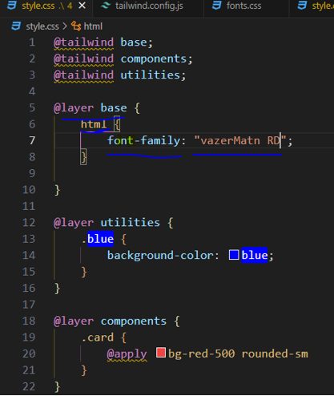

که البته این روش خیلی جالب نیست و از روش دوم یعنی داخل فایل کانفیگ font-family رو انتخاب میکنیم و یه اسم برای فونت میزاریم و مقدار دلخواه فونتمون رو بهش میدیم.


---

> # یوتلیلیتی Font Size

 میخوایم یوتیلیتی های مربوط به فونت سایز رو برسی کنیم . چطوری میتونیم  اندازه یا سایز فونت های نوشته ها و متن های خودمون رو تغیر بدیم وارد وب سایت tailwindcss.com و از منوی بالا Docs  و بخش Typography  , قسمت فونت سایز ها میشیم و سایز ها و یوتیلیتی های سایز رو میبینیم که برامون لیست کرده
 
https://tailwindcss.com/docs/font-size#class-reference

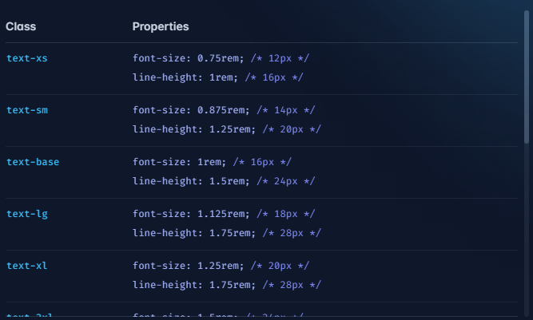

| Class       | Properties |
| ----------- | ----------- |
| text-xs	    | font-size: 0.75rem; /* 12px */  line-height: 1rem; /* 16px */       |
| text-sm	    | 	font-size: 0.875rem; /* 14px */   line-height: 1.25rem; /* 20px */        |
| text-base   | font-size: 1rem; /* 16px */  line-height: 1.5rem; /* 24px */        |
| text-lg     | font-size: 1.125rem; /* 18px */  line-height: 1.75rem; /* 28px */        |
| text-xl	    | font-size: 1.25rem; /* 20px */  line-height: 1.75rem; /* 28px */        |
| text-2xl	  | font-size: 1.5rem; /* 24px */  line-height: 2rem; /* 32px */        |
| text-3xl    | font-size: 1.875rem; /* 30px */  line-height: 2.25rem; /* 36px */        |
| text-4xl    | font-size: 2.25rem; /* 36px */  line-height: 2.5rem; /* 40px */        |
| text-5xl	  | font-size: 3rem; /* 48px */  line-height: 1;        |
| text-6xl    | font-size: 3.75rem; /* 60px */  line-height: 1;        |
| text-7xl    | font-size: 4.5rem; /* 72px */  line-height: 1;        |
| text-8xl    | font-size: 6rem; /* 96px */  line-height: 1;        |
| text-9xl	  | font-size: 8rem; /* 128px */  line-height: 1;        |


که بصورت پیشفرض  text-base که 1rem است و برابر 16px است.
از text-xs تا text-9xl رو داره که تفاوت اینا تو سایز شون است.
معمولا تجربه ثابت کرده که این سایز ها کاربردین و کارمارو حل میکنه و نیازی نیست معمولا خودمون برای یه سایزی تعریف کنیم یوتیلیتی رو یا اونا رو اوررایت یا تغیری بدیم.
یه نکته دیگه این یوتیلیتی های فونت سایز علاوه براینکه سایز متن رو مشخص میکنن line-height رو هم میده که ظاهر بهتری رو داشته باشه متن مون ارتفاعش  البته که خومون میتونیم با اون یوتیلیتی لاین هات اون رو زیاد و کم تغیربدیم  


ویا حتی موقعی که داریم از یوتیلیتش فونت سایزش استفاده میکنیم همونجا داخل کلاس هم میتونیم لاین هایتش رو تغیر بدیم

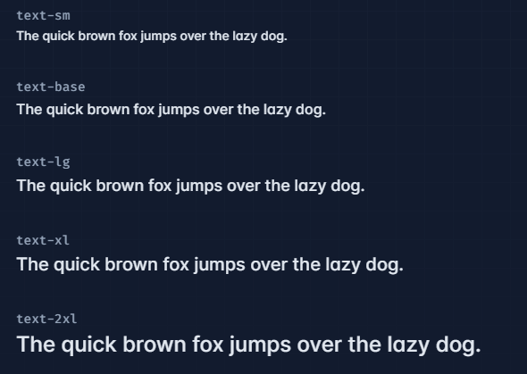

اگه دقت کرده باشین خود تلویند برای سایزها از rem  استفاده کرده ونتنها برای فونت سایزها بلکه در ادامه هرجایی که از سایز ها استفاده میکنه الزامن از rem استفاده میکنه و هیچ موقع از px  استفاده نمیکنه که البته خودش اون یونیت rem رو استفاده میکنه  

البته پیشنهاد میشه توی پروژه ها از یونیت rem  استفاده کنین هالا چه تلویندی و چه غیر تلویندی از یونیت rem استفاده کنین چون بعدن میتونین فونت سایز تگ html رو تغیر بدین واون موقع دیگه همه اندازه ها همه فونت سایز ها همه مارجین ها همه پدینگ ها و همه این چنین مواردی باتوجه به اون تغیر اندازه  تگ html تون تغیر میکنه  و مهم تر از اون که کمتر کسی بهش توجه میکنه اگر که کاربر سایت شما  یه کاربر کمبینا باشه مشکل بینایی داشته باشه  خب شاید این کاربر توی تنضیمات مرورگرش  اندازه فونت های مرور گر که بصورت پیشفرض  Medium (recommend) است رو روی  very Large گزاشته باشه 


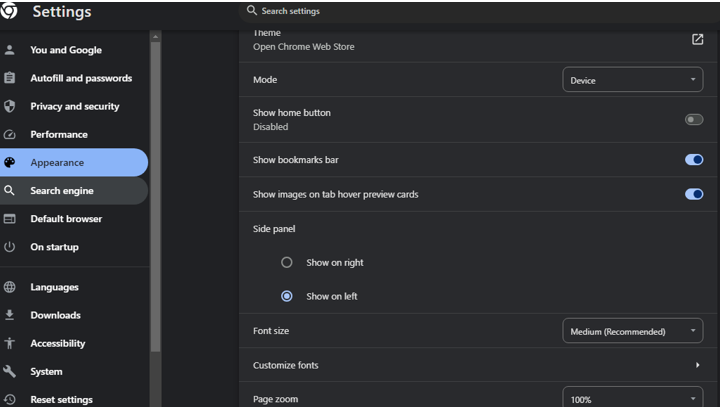
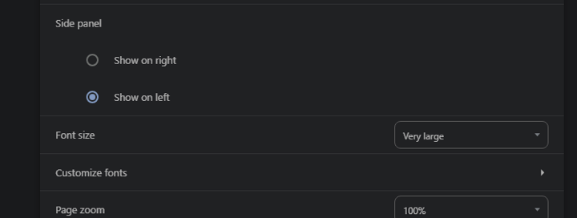


که بتونه متن ها رو بهتر ببینه ممکنه همچین کاری کرده باشه اگر سایت شما از rem استفاده کرده باشه باتوجه به این تغیر اندازه تنضیمات مرورگر واندازه ای که اونجا انتخاب کرده فونت های نوشته های سایت شما هم تغیر میکنه 
پس درنتیجه اگه شما از یونیت rem استفاده کنیم کاربرهای کم بینا هم تجربه کاری بهتری رو توی سایت شما خواهند داشت

---
> # برسی روش افزودن مقادیر دلخواه برای یوتیلیتی ها واضافه کردن مقادیر دلخواه Font Size


البته قبلا هم یاد گرفتیم که چطوری فایل کانفیگی تلویند رو ویرایش کنیم و داستانش چیه  ولی تو این جلسه میخوایم مقادیر دلخواه خودمون رو برای فونت سایز اضافه کنیم وعلاوه بر اون میتونیم فونت سایز هایی خود تلویند هم اوررایت یاتغیر بدیم.

سایت خود تلویند دم دستمون باشه که توضیحات و مثال هایی زده

https://tailwindcss.com/docs/font-size


برای مثال الان ما میاییم یه یوتیلیتی جدید با مقدار جدید رو درست میکنیم 
وارد فایل کانفیگی تلویند میشیم  و داخل extend مینویسم fontSize  و داخلش یه اسم  براش درنظر میگیریم مثلا xsm و مقدارش رو هم مثلا   
 "0. 8 rem" میزاریم  که تلونید همچنین اندازه ای نداره  خب هلا این اسم که براش گزاشتیم در سراسر پروژه قایل دسترس است و میتونیم برای هر عنصر که میخوایم تو کلاسش بصورت یوتیلیتی بنویسیم.


حالت بعدی که میخوایم برسی کنیم حالتیه که یکی از یوتیلیتی های فونت سایز خود تلویند رو اوررایت کنیم تغیر بدیم مقدارشو
برای مثال یکی از یوتیلیتی های فونت سایز خود تلویند text-2xl است که درحالت عادی تلویندی سایزشو 1.5rem گزاشته و ما مثلا میخوایم اندازشو 1.3rem تغیر بدیم
یه نکته ای که بهش دقت کنیم چون 2xl است اسمش و عدد داخلشه باید اون رو بصورت استرینگ "2xl" بنویسیم


الان دیگه هر جا از text-2xl این یوتیلیتی استفاده کنیم بجای مقدار 1.8rem  مقداری که اوررایت کردیم 1.3rem است.

اگه خاطرتون باشه گفتیم که یوتیلیتی های فونت سایز علاوه بر سایز مقدار line-higet   رو هم مشخص میکنند اگ که احیانن شماهم خواستین توی کانفیگ تلویند چه موقع اضافه کردن یه مقدار جدید  چه موقع اوررایت کردن یک مقدار قبلی  لاین هایت روهم مشخص کنید باید مقدار رو داخل یه ارایه بزاریم و مقدار دوم  استیریگ  مقدار لاین هایت رو هم بنویسیم


```css
      fontSize : {
        xsm : ["0.8rem" , "4rem"]
        
      }
```

---

> # آشنایی با مقادیر Arbitrary برای یوتیلیتی های تلویند


قراره مقادیر Arbitrary تلویند رو باهم برسی کنیم . که یکی از بهترین ها و کاربردی ترین های تلوینده .
بصورت کلی گفتیم که مامیتونیم داخل فایل کنفیگ تلویند مقادیر جدید خودمون رو برای یوتیلیتی های مختلف تلویند تعریف کنیم . 
اما بعضی وقتا ممکنه پیش بیاد که میخوایم از یک مقداری فقط یک بار استفاده کنیم یا یکی دو بار استفاده کنیم  ودیگه برامون نمیصرفه که اون رو داخل فایل کانفیگ تلونید تعریف کنیم و برای همه عناصر و همیشه در دسترس باشه این جو مواقع میتونیم از مقادیر Arbitrary تلویند استفاده کنیم.

هالا چطوری ؟ این جور مواقع بجای اینکه بیاییم تو فایل کانیفیگ تلویند یه یوتیلیتی رو تعریف کنیم و براش مقداری بدیم یعنی یه اسمی بهش بدیم و کنارش  مقدارشو تعریف کنیم  و بعد از یوتیلیتیش استفاده کنیم  مستقیمن میاییم همونجا داخل عنصر  اسم اون پراپرتی ویه مقدارش  که بصورت سی اس اس میتونیم بنویسیم داخل ```  [] ```

```html
text-[4rem]
```


پس این قابلیت زمانی کاربرد داره که شما بخوایید از یک مقدار  خیلی دم دستی و سریع یکجا استفاده کنین. 

هالا اگه خاستن هم سایز و هم line-height رو هم مشخص کنیم  باهم 

```html
text-[4rem]/[8rem]
```


 در کل هر جایی که تلونید بعدش از ما یک مقداری میگیره مثل پدینگ و... میتونیم از این ویژگی  Arbitrary استفاده کنیم.
 
 ---


 > # یوتیلیتی های مربوط به Font-style و Font weight


میخوایم با یوتیلیتی های مربوط به font style و font weight تلویند اشنا بشیم .
خب همونطور که میدونین ما با پراپرتی font style تویcss  ایتالیک بودن و نبودن متن ها مون رو مشخص میکنیم و با font weight وزرن فونتون رو مشخص میکنیم. که قاعدتن برای این موضوع توی تلونید هم یوتیلیتی هایی روداریم 
داکیومیشن تلویند رو کنار دستمون باز میکنیم 

https://tailwindcss.com/docs/font-style


 
تلویند برای قضیه font style ها صرفن دوتا یوتیلیتی در اختیار ما قرار داده 


| class      | Properties |
| ----------- | ----------- |
| italic      | font-style: italic;       |
| not-italic  | font-style: normal        |


Italic  و not-italic:

not-italic

The quick brown fox jumps over the lazy dog.


italic

<em>The quick brown fox jumps over the lazy dog. </em>


این not-italic یه جورایی اثر italic رو خنثا میکنه  هلا کجا کاربرد داره ؟
فرض کنین که یه div  والد داریم که دوتا p داخلش هست و به والد که div  است یوتیلیتی italic   رو دادیم الان اون تگ p ها هم دوتاشون بصورت  italic هستند متن هاشون ولی ما میخوایم یکی از p ها نورمال باشه به اون یوتیلیتی  not-italic رو میدیم.

هالا نکته ای که راجب این دوتا یوتیلی وجود داره اینه که برخلاف سایر یوتیلیتی ها 	دیکه قابلیت شخصی سازی یا تغیر مقدار که مثلا مقدار جدیدی براشون انتخاب کنید رو که تو فایل کانفیگ تلویند انجام میدادیم رو نداره به این علت که خود css  هم همین دوتا پراپرتی رو داره یعنی یا font-style : italic یا font-style: normal و خب تلویند هم از جفت اینا برای هرکدوم یه یوتیلیتی ساخته  و دیگه عملا نیازی به ویرایش کردن یا تغیر مقدارشون ختی بصورت arbitrary  هم نیست
یه نکته دیگه ما توی css یه پراپرتی دیگه فونت استایل رو داریم به اسم oblique  که تلویند دیگه نیومده برای این یوتیلیتی ینویسه چون خیلی کمتر استفاده میشه و خیلی چیز رایجی نیست هلا اگه ما نیاز داشتیم یه فونت استایل برای این هم داشته باشیم میتونیم خودمون توی فایل استایل شیت ورودی تلویند و داخل ```layer utilities@``` که بصورت کامل قضیشو برسی کردیم  خودمون یه یوتیلیتی برای این درست کنیم.


و هرکجا نیاز داشتیم استفاده کنیم ولی همنطور که گفتیم این فونت استایل oblique زیاد رایج نیست
که خروجی شو هم براتون اوردم که تفاوت هاشونو بینین


یوتلیتی بعدئ فونت ها که بریم سراغش یوتیلتی font weight است
همونطور که میدونین فونت ها میتونند وزن های مختلفی داشته باشند وزمانی که ما چند وزن از یک فونت رو به پروژه مون اضافه میکنیم میتونیم font weight وزن های متن های خودمون رو مشخص کنیم و از اون ورزن ها استفاده کنیم .

https://tailwindcss.com/docs/font-weight

درحالت عادی تلویند 9 وزرن مختلف برای font weight  داره


| class      | properties |
| ----------- | ----------- |
| font-thin      | font-weight: 100;      |
| font-extralight   | font-weight: 200;   |
| font-light   | font-weight: 300;        |
| font-normal  | font-weight: 400;        |
| font-medium  | font-weight: 500;        |
| font-semibold | font-weight: 600;       |
| font-bold | font-weight: 700;       |
| font-font-extrabold | font-weight: 800;       |
| font-font-black | font-weight: 900;       |


اگه خاطرتون باشه ما فونت وزیر متن و هر 9 تا وزرن رو قبلا اضافه کردیم
بنابراین میتونیم از هر تا این 9 وزن ها که یوتیلیتیش هست استفاده کنیم برای فونت مون


Font weight هایی یوتیلیتی های تلوند قابلیت شخصی سازی و تغیر دارند یعنی میتونیم مقدار مربوط به هر font-weight  رو داخل فایل کانفیگ تغیر بدیم 
مثلا extralight  که 200 هست رو بزاریم 400 تغیرش بدیم 


الان یکی از مقادیر تلویند font-weight رو ویرایش یا اوررایت کردیم.
میتونیم مقادیر جدید رو هم بنویسیم


و الان میتونیم به یوتیلیتی font-veryblack هم دسترسی داشته باشیم و استفاده کنیم ولی چون فونتی با ورزن 1000 تعریف نکردیم همون تا900 شبیه به black است.

از مقادیر Arbitrary هم میتونیم استفاده کنیم که قبلا بهاش اشناشدیم

```html
<p class="font-[1100]">
متن تستی
</p>
```


یه نکته برای    Arbitrary اگه دقت کرده باشین هم برای fontFamily ها و هم font weightها اول کلمه یوتیلیتی هاشون font است و با ادامه این کلمه مشخص میشه که منضور  font familyاست یا  font weight است و اگه از روش arbitrary   استفاده کنیم و بنویسیم font-[] و داخل [] ما چیزی بنویسیم خود تلویند تشخیص میده  که برای font family  است یا  font weight است .

---

> # یوتیلیتی Line Clamp برای مشخص کردن حداکثر تعداد خطوط قابل مشاهده


این یوتیلیتی کمتر شناخته شده ولی خیلی جاها کاربردیه مخصوصن وقتی شما دارین کار های محتوایی رو نشون میدید خصوصن برای مقالات قطعا این یوتیلیتی به درد میخوره 
که سینتکس نوشتاری این یوتیلیتی line-clamp-1 است که تا line-clamp-6
  و line-clamp-none رو شامل میشه 


| class       | Properties |
| ----------- | ----------- |
| line-clamp-1    | overflow: hidden; display: -webkit-box; -webkit-box-orient: vertical; -webkit-line-clamp: 1;|
| line-clamp-2    | overflow: hidden; display: -webkit-box; -webkit-box-orient: vertical; -webkit-line-clamp: 2;|
| line-clamp-3    | line-clamp-3	overflow: hidden; display: -webkit-box; -webkit-box-orient: vertical; -webkit-line-clamp: 3; |
| line-clamp-4    | overflow: hidden; display: -webkit-box; -webkit-box-orient: vertical; -webkit-line-clamp: 4; |
| line-clamp-5    | overflow: hidden; display: -webkit-box; -webkit-box-orient: vertical; -webkit-line-clamp: 5; |
| line-clamp-6    | overflow: hidden; display: -webkit-box; -webkit-box-orient: vertical; -webkit-line-clamp: 6; |
| line-clamp-none   | overflow: visible; display: block; -webkit-box-orient: horizontal; -webkit-line-clamp: none;|


که البته میتونیم هر کدوم رو ویرایش کنیم و مقادیر Arbitrary  یا تغیر مقادیر از طریق فایل کانفیگ  رو هم میتونیم.

زمانی که ما از این یوتیلیتی استفاده میکنیم عملا تعداد خطوط متن مون به این عددی که مینویسسم محدود میشه line-clomp-4 

وب سایت تلویند سی اس اس و قسمت line clamp رو دم دستمون باشه 

https://tailwindcss.com/docs/line-clamp


این تگ p داخل تصویر طولانیه و بیشتر از 3 خط هست ولی از یوتیلیتی line-clamp-3  استفاده کرده و تا سه خط رو نمایش داده و بقیشو بجای اضافش ... گزاشته  
یعنی زمانی که خاستیم یه جورایی یه پیش نمایش از مقاله یا کاردی داشته باشیم که دخلش متنی است و بخوایم فقط یه پیشنهایش از اون متن یا توضیجات رو ببینیم این یوتیلیتی خیلی به درد میخوره
خطوط قابل شماهده رو محدود میکنه به اون عددی که بهش میدیم
حتی اگه عرض صفحه هم کوچیک و بزرگ بشه خودش اون 3 خط رو حفض میگنه و بقیشو حذف میکنه .

یه مثال بزنیم


یه مقدار دیگه هم داره این یوتیلیتی که line-clamp-none است  که عنصر اگه line-clamp داشته باشه اون رو خنثا میکنه که کاربردش تو بحث ریسانسیو یا جایی اگه خاستین میشه استفاده کرد مثلا اگه طول یا عرض این مقدار شد که روی این کلیک شد این حنثا بشه.

همچنین خودمون هم میتونیم مقدار جدیدی رو درست کنیم مثلا
 line-clamp-11 و هرکجا که مثلا متن ما 30 خط هست و میخوایم فقط 11 خط رو نمایش بده و یه ... بزاره بقیشو میتونیم خودمون درست کنیم ابتدا وارد فایل کانفیگ تلویندیمون میشیم tailwind.config.js


---

# > یوتیلیتی Line Height	


میخوایم یوتیلیتی های مربوط به line height رو برسی کنیم . توی css همونطور که میدونین ما از طریق تغیر دادن پراپرتی line height  میتونیم ارتفاع خطوط اون متن رو تغیر بدیم.


همون جلسه ای که داشتیم موضوع فونت سایز ها رو یاد میگرفتیم یه اشاره کوچیک به قضیه line height ها کردیم .
الان هم بهتر این قضیه line height  و یوتیلیتی هاشو برسی میکنیم  و همچنین ادغام کردن line height و font size روبرسی میکنیم یعنی یاد میگیریم که چطوری موقع مشخص کردن فونت سایز line height رو هم کنارش مشخص کنیم که تلویند یه سینتکسی برای این موضوع برای ما قرار داده.
طبق واروال همیشه داکیومیشن تلویند دم دستمون باشه 
https://tailwindcss.com/docs/line-height
برای مقادیر line-height میتونیم تو css  هم مقادیر یونیت داربا rem و هم مقدیر یونیتلیس  که یه عدد خالی است  تلویند برای هرکدوم  یوتیلیتی هایی رو تعرف کرده


| class      | propertise |
| ----------- | ----------- |
| leading-3   | line-height: .75rem; /* 12px */       |
| leading-4   | line-height: 1rem; /* 16px */        |
| leading-5   | line-height: 1.25rem; /* 20px */        |
| leading-6   | line-height: 1.5rem; /* 24px */        |
| leading-7   | line-height: 1.75rem; /* 28px */        |
| leading-8   | line-height: 2rem; /* 32px */        |
| leading-9   | line-height: 2.25rem; /* 36px */        |
| leading-10  | line-height: 2.5rem; /* 40px */        |
| leading-none   | line-height: 1;        |
| leading-tight   | line-height: 1.25;        |
| leading-snug   | line-height: 1.375;        |
| leading-normal   | line-height: 1.5;        |
| leading-relaxed   | line-height: 1.625;     |
| leading-loose   | line-height: 2;        |

هالا شما بسته به اون کاربرد مدنظرتون هست میتونین از هرکدوم استفاده کنین
البته که این یوتیلیتی line-height  که تو تلویند leading است قابلیت استفاده arbitrary رو داره  و همچنین توی فایل کانفیگ تلویند هم میتونیم مقادیرشو شخصی سازی و تغیر بدیم اگه خاستیم  مثل اکثر یوتیلیتی های تلویند.


``` یه نکته اون عدد هایی که کنار یوتیلیتی ها هستند مثل همین یوتیلیتی leading-3 این عدد 3 که برابر .75rem است هرعدد که تلونید استفاده میکنه یعنی عدد 1 برابر .25rem است که هر کجا یوتیلیتی های تلویند از عدد استفاده شد مثل همین leading ها و یا padding , margin ها و... که عدد گزاشت هر عدد بدونین که برابر .25rem  است و مثلا اگه 3 بود یعنی .75rem یعنی .25rem * 3 شده ```


بصورت پیشفرض چون فونت سایز متن ها تو تلونید بصورت پیشفرض text-base است و این برابر فونت سایز 1rem و line-height 1.5rem است اگه خاطرتون باشه تو اون جلسه فونت سایز ها گفتیم 


پس بصورت پیشفرض این هست هرمتنی که مینویسیم  چون تغیرش ندادیم.


هلا بریم مثال هاشو بصورت عملی ببینیم


همچنین بصورت Arbitrary هم همنطور که گفتیم میتونیم مقدار leading رو مشخص کنیم

```html
<p class"leading-[3rem]">
<!-- ... -->
</p>
```

:warning: نکته : شما هر مقدار که بعنوان line height تون دارین هلا چه مقدار دیفالت خود تلونیدی چه مقادیری که ممکنه تو فایل کانفیگی تون بنویسید  رو میتونین همزمان با مشخص کردن فونت سایزتون هم مشخص کنید یعنی ادغامشون کنیم باهم خب چطوری؟

لازم نیست که فونت سایز رو بنویسم که هم سایز فونت رو داره و هم یه لاین هایت ارتفاع متن ها از هم رو داره و بعد لاین هایت خودمون رو مشخص کنیم که اون لاین هایتی که براش نوشتیم جایگزین اون لاین هایتی که با فونت سایز همراه است جایگزین و ادغام بشه که البته اینطوری هم کار میکنه این سینتکس ولی خوب نیست 


از این سینتکس تصویر پایین استفاده میکنیم :point_down:


و همچنین برای واحد یا یونیت های رمی هم به همین شکل است


یا اینکه اگه خاستیم بصورت Arbitrary بنویسم 


بعث بعدی تغیر دادن مقادیر و مقادیر جدید تو فایل کانفیگی تلویند است


``` یه نکته: معمولا این یوتیلیتی leading  و text- یعنی مال فونت سایز و لاین هایت ارتفاع خط متن ها رو باهم بصورت ادغام شده استفاده میکنن مگر اینکه یه جا بصورت جدا بخوایم استفاده کنیم ```

---

> # یوتیلیتی Text Align	

میخوایم یوتیلیتی های مربوط به Text Align تلویند رو باهم برسی کنیم خب همونطور که میدونین ما توی css پراپرتی text-align رو داریم که به ما کمک میکنه که جهت و تراز متن مون رو مشخص کنیم یعنی مشخص کنیم که متن 
هامون از سمت راست نوشته بشن یا از سمت چپ یا وسط چین باشن و خب قاعدتن توی تلویند هم یوتیلیتی های مربوط به این ومقادیرش وجود داره.

داکیومشن تلویند رو باز داریم که برای این 

https://tailwindcss.com/docs/text-align


<div align="center">
Text Align


| class      | properties |
| ----------- | ----------- |
| text-left      | text-align: left;       |
| text-center   | text-align: center;      |
| text-right   | text-align: right;        |
| text-justify   | text-align: justify;    |
| text-start   | text-align: start;        |
| text-end   | text-align: end;            |

</div>

با یوتیلیتی text-left , text-right , text-justify  , text-center که برابر پراپرتی هایی css هستن باید اشنا باشین تو css هم داشتیم فقط اون text-end , text-start  بر اساس dir زبان یا جهت صفحه سندمون تصمیم میگیرند که سمت راست باشه یا چپ

``` تلویند 6 تا یوتیلیتی برای text align درنظر گرفته که خب هر 6 تا مقادیری که text align میتونه دریافت کنه رو دراختیار ما قرار داده  از اونجایی که پراپرتی text-align  همین 6 تا مقدار رو داره و نمیتونه مقدار دیگه ای رو بگیره جز این 6 تا قابلیت Arbitrary رو نداره که بخواییم مقادیر دلخواهی رو بهش بدیم و همچنین توی فایل کانفیگ تلویند هم قابلیت ویرایش یا افزودن مقادیر جدیدی رو نداره چون در کل تو css هم همین 6 تا هستند. مقدار دیگه ای هم نداره که بگیم خودمون براش یوتیلیتی جدیدی براش بسازیم . ```

``` میبینیم که فرم کلمه اولشون با کلمه اول font size یکی است بعنی هردوتا اول کلمه شون text است برای فونت سایز مثلا text-lg برای text align  هم مثلا text-justify رو داریم . تلونید یه همچین یوتیلیتی هایی رو زیاد داره که کلمه اولشون مشابه باشه و از نوشتن دومی میشه فهمید که منضور کدوم است قسمت اولشون مشترکه اما با توجه به قسمت دومشون یه عملکرد کاملا متفاوتی رو دارند و خود تلویند بصورت خودکار باتوجه به قسمت دوم اینا رو از هم تفکیک میکنه ```


---


> # یوتیلیتی text color

قراره که یوتیلیتی های مربوط به color رو که توی css داشتیم رو برسی کنیم که با استفاده ازش میتونیم رنگ متن ها مون رو تعین یا تغیر بدیم توی تلویند هم یه یوتیلیتی برای این قضیه وجود داره که میخوایم با اون مورد اشناشیم.

داکیومیشن تلویند رو داریم 
https://tailwindcss.com/docs/text-color


تعداد شون زیاده با مراجعه به لینکی که گزاشتم میتونین همه شونو ببنینید.

رنگ متن ها قابلیت شخصی سازی داره توی فایل کانفیگ میتونیم رنگ های دیفالت تلویند رو تغیر بدیم یاحتی رنگ های مورد نظر خودمون رو اضافه کنیم
یه نکته مهم راجب رنگ ها تو تلویند اینکه شما یک بار یه پالت رنگی روتعریف میکنید یا رنگ های دلخواه خودتون رو تعریف میکنید یا اصلا رنگ های پیشفرض تلویند رو ویرایش میکنین و از اون به بعد دیگه این رنگ ها برای هر یوتیلیتی که رنگ پذیر است در دسترس است مثلا این پالت های رنگی که تو تصویر صفحه قبل هستند برای مثال برای رنگای بکگراند هم در دسترس است مثلا برای border ها هم در دسترس هست ```  یعنی پالت رنگی تلویند مشترک است بین  همه یوتیلیتی هایی که رنگ پذیر هستند. ```
برای مثلا  ما وفتی از bg-red-500 استفاده میکنیم اون bg اول مربوط به بکگراند است و اون red-500  مربوط به رنگها است که اون رو برای text ها هم داریم  پس داستان پالت رنگی همینه شما یه بار که پالت رنگی تون رو که مشخص کنین یا ویرایش کنین دیگه اون پالت رنگی برای همه یوتیلیتی های رنگ پذیر در دسترس و قابل استفاده است.

که علاوه بر اوینا میتونیم ازArbitrary هم استفاده کنیم  و داخل [] کد رنگی مورد نظرمون رو میتونیم قراربدیم

  


  و اگه از مقادیر بجای کد رنگی از rgb استفاده میکنین دقت کنین که بدون فاصله بنویسید که تلیوند تشخیص بده اگه فاصله باشه بینشون تلویند نمیتونه به خوبی اون رو تفصیر کنه و دچار مشکل میشه

   


اگه پالت رنگی دارین خودتون یا از جایی میخواید بیارین و به رنگ های تلویند اضافه یا ویرایش کنین تو قسمت بعدی میریم سراغ اون بخش که نتنها برای رنگ متن ها بلکه برای هر یوتیلیتی رنگ پزیری قابل استفاده است
   

---

> # برسی پالت و رنگ های دیفالت تلویند و افزودن پالت رنگی دلخواه


میخوایم پالت رنگی تلویند رو باهم بصورت کامل برسی کنیم و همچنین پالت رنگی دلخواه خودمون رو هم به تلویند اضافه کنیم .

همونطور که گفتیم رنگها توی تلویند بین یوتیلیتی های رنگ پذیر مشترک هست
یعنی شما میتونین یه بار رنگ های مختلف دلخواه خودتون رو توی کانفیگ تلویند مشخص کنین و از اون به بعد  به این رنگها در سرتاسر تلونید بین یوتیلیتی های  که از رنگ استفاده میکنند هلا چه text color  باشه چه border color باشه چه background color  باشه  و الا اخر قابل استفاده هستند و میتونین به اون رنگها دسترسی داشته باشین پس بنابر این این قسمت مهمه.

خب داکیومشین تلویند رو داریم
https://tailwindcss.com/docs/customizing-colors
همون ابتدا همه رنگ ها اسمشون هست و زیر هر متن رنگ انواع پالت های رنگیشون هستند که خییلی زیاد هستند   که سه تا رو برای مثال اوردیم 

<div align="center">

</div>

ولی احیانن اگه شما این همه رنگ ها براتون کم بود یا خاستین تغیر بدین یا پالت رنگی خودتون رو اضافه کنین 
وارد فایل کانفیگی تلویند میشیم مثلا میخوایم رنگ جدیدی رو اضافه کنیم  برای تعریف کردن رنگ های جدد به تلویند چند تا راه هست 

راه اول اینه که میتونیم یه اسمی رای رنگمون بزاریم  و مقدار کد رنگی 


این رنگ قهوه ای توی است که تقریبا به اسم kookie میاد خب هالا میتونییم از این یوتیلیتی توی یوتیلیتی های رنگ پزیر مثل text color استفاده کینم


خب دومین روش میتونیم طیف های رنگی رو هم درست کنیم مثل همون کاری که خود تلویند انجام داده مثلا برای رنگ red-50 تا red-900 رو داره


همونطور که داخل تصویر دیدین هلا الزامی نیست که از 100  یا هر عدد دیگه فقط استفاده کنیم میتونیم از اسم ها هم استفاده کنیم برای طیف های رنگیش 


و متقابلا میتونیم بجای text-kookie-soft  از text-kookie-100 هم استفاده کنیم.

هلا احیانن اگه خاستیم رنگ های خود تلویند رو ویرایش یا اوررایت کنیم
مثلا رنگ red-100 بصورت پیشفرض رنگ قرمز کمرنگ یا روشن است که تلویند گزاشته 


 الان اون رنگ قرمز روشن که تلویند گزاشته بود رو تغیر دادیم

```یه نکته مهم  ما گفتیم که ما میتونیم برای رنگ هایی دلخواه خودمون رو اضافه کنیم به تلویند و انواع طیف های رنگی رو براش بنویسیم  یه نکه ای که هست ما میتونیم مقدار دیفالت رو هم براش بنویسم که اگه از طیف های رنگیش استفاده نشد بصورت دیفالت همون رنگ اعمال میشه  که توی تصویر پایین بهتر متوجه این میشین```


هالا موقعی که میخوایم از این یوتیلیتی که درست کردیم و مقدار دیفالت هم داره استفاده کنیم.


به همین شکل وقتی ادامه شو یعنی طیف هاشو ننویسیم اینطوری خودش مقدار دیفالتی که براش مشخص کردیم رو انتخاب میکنه  که رنگ قرمز رو بهش دادیم.

قضیه بعدی که میخوایم بهش اشاره کنیم یه سایت  [uicolors.app](https://uicolors.app/create) است که خودتلویند هم  بهش اشاره کرده توی همین بخش رنگ ها اگه یکم بیایین پایینتر 


 [https://uicolors.app/create](https://uicolors.app/create)

برای ایجاد پالت های رنگی دلخواهمون میتونیم ازش استفاده کنیم که توش میتونیم یه  کد رنگی وارد کنیم  یا انتخاب کنیم و خود این سایت بصورت خودکار یک پلت رنگی از اون رنگ برامون ایجاد میکنه  که از طیف 50 تا 950 برامون درست میکنه و همچنین یه دکمه export هم داره که اگه بزنیم خودش به فرمت تلویند اون رو برامون مینویسه  و میتونیم کپی کنیم و توی فایل کانفیگی تلویند مون بزاریم


هر رنگی که دوست داشتیم رو میتونیم انتخاب یا کد رنگی شو بنویسم 


و به همین صورت طیف هایی که  برامون نوشت رو هم میتونیم کپی کینم
خودشم یه اسمی باتوجه به اون رنگی که بهش دادیم و طیف هایی که درست کرده برامون میزاره که میتونیم تغیرشم بدیم و از این یوتیلیتی رنگی که درست کردیم استفاده کنیم .

هالا علاوه بر این سنتکس تلوندی فایل کانفیگی که برامون میسازه میتونیم بصورت css هم داره  و برای فیگما و... هم هست که حتما بهش سر بزنین و ببین و چند تا مثال و جا هایی که بهمون پیشنهاد میده که از این رنگ هایی که درست کردیم  برای دکمه ها و.. هم چند تا مثال زده که اگه دوست داشتیم میتونیم ازش ایده بگیریم که تصور بهتری داشته باشیم 


``` یه نکته سعی کنین همون ابتدای پروژه پالت های رنگی پروژه تون رو مشخص کنین همون ابتدا ```


همچنین تو لینک همین بخش رنگها توی تلویند منابع دیگه ای رو هم قرار داده که یه کم پیچیده تر است که اگه دوست داشتین واردشون بشین و بخونین همین ui colors  خیلی اوکیه کارو درمیاره
مورد بعدی استفاده کردن از default color   که توی فایل کانفیگ تلویند هستند
یه زمانی هست که شما بخواید اسم هایی که تلویند برای  زنگ هاش مشخص کرده  رو تغیر بدین نه مقدار رنگشو  مثلا 


مثلا این یوتیلیتی رنگ slate اسمشو میخوایم بزاریم suftblue باشه
این جور مواقع میتونیم بیاییم و از default value های تلویند استفاده کینم توی فایل کافیگمون هلا چطوری؟ کافیه که بیاییم از این سینتکس استفاده کینم در ابتدای فایل کانفیگ تلویند یه متغیری به اسم colors درست کنیم به همین شکل

```js
const colors = require('tailwindcss/colors')
```
 مطابق همین تصویر که توی همین لینک اول این قسمت که گزاشتم سایت تلویند قسمت رنگها بیایین پایین یکم اسکرول کنین اون بخشو  
براینکه توی فایل کانفیگمون در دسترس قرار بگیره هالا همه رنگ های پیشفرض تلویند داخل همین متغیر colors  وجود داره وهالا ما از اینطریق  میتونیم اسم های پیشفرض رنگ های تلویند رو عوض یا ویرایش کنیم هالا توی بخش extend فایل کانفیگ اسم جدید مدنظرتون رو مشخص میکنین مثلا softBlue و  یه : میزارین اون متغیر colors رو مینویسیم و یه نقطه اسم اون رنگی که میخوایم تغیربدیم اسمشو softBlue: colors.slate  الان تغیر اسم پلت slate  رو به softBlue معرفی میشه 
یعنی الان میتونیم به همه مقادیر پالت رنگ slate با اسم suftBlue به طیف های رنگیش دسترسی داشته باشیم

---

> # استفاده از یوتیلیتی opacity و اعمال آن به رنگ ها


قراره یوتیلیتی opacity تلویند برای رنگ ها طبق روال  داکیومیشن تلونید رو باز میکنیم بخش Effectts و opacity 
https://tailwindcss.com/docs/opacity


| class      | properties |
| ----------- | ----------- |
| opacity-0      | opacity: 0 |
| opacity-5      | opacity: 0.05 |
| opacity-10      | opacity: 0.1 |
| opacity-15      | opacity: 0.15 |
| opacity-20      | opacity: 0.2 |
| opacity-25      | opacity: 0.25 |
| opacity-30      | opacity: 0.3 |
| opacity-35      | opacity: 35 |
| opacity-40      | opacity: 0.4 |
| opacity-45      | opacity: 0.45 |
| opacity-50      | opacity: 0.5 |
| opacity-55      | opacity: 0.55 |
| opacity-60      | opacity: 0.6 |
| opacity-65      | opacity: 0.65 |
| opacity-70      | opacity: 0.7 |
| opacity-75      | opacity: 0.75 |
| opacity-80      | opacity: 8 |
| opacity-85      | opacity: 0.85 |
| opacity-90      | opacity: 0.9 |
| opacity-95      | opacity: 0.95 |
| opacity-100      | opacity: 1 |


همونطور که میبینید تلونید برای opacity یوتیلیتی های زیادی گزاشته از opacity 0 تا opacity 1  که یوتیلتی هاش از 0 تا 100 قرار داده برامون

خب بریم یه دور تست کنیم


```html
  <body>
    <div dir="rtl">
      <p class="bg-red-800 opacity-25">متن فارسی لوریم است برای تست</p>
    </div>
  </body>
```


همونطور که میبینید یه تگ p داریم که یک بکگراند قرمز پررنگ داره و opacity رو هم بهش دادیم الان کمرنگ و شفاف شده هم متن و هم بکگراندش  دقت کنین که چون بکگراند رو به تگ p دادیم و opacity رو هم برای همون تگ p مشخص کردیم  ولی اگه بکگراند رو میدادیم برای والدش دیگه اونopacity مال تگ p  فقط روی اون متن داخلش کار میکرد و رو بکگراند تاثیر نمیزاره چون opacity روی تگ p  است .

همچنین میتونیم بجای نوشتن opacity-number میتونیم از روش Arbitrary هم استفاده کینم  فقط دقت کنین که عددی که داخل [] به روش Arbitrary مینویسید باید بین 0 تا 1 باشه چون opacity همینه بین همین عدده 


```html
  <body>
    <div dir="rtl">
      <p class="bg-red-800 opacity-[0.2]">متن فارسی لوریم است برای تست</p>
    </div>
  </body>
```

همچنین توی فایل کانفیگ تلویندمون هم میتونیم مقادیر جدید opacity اگه خاستیم تعریف کنیم


مقادیر دیفالت رو اسماشونو هم که تلویند برای یوتیلیتی opacity نوشته که از opacity-0 تا opacity-100 هستند رو هم میتونیم تغیر بدیم اسماشو ولی همون اسمایی که گزاشته عالیه  منطقی نیست چون اسماشون خیلی به مقدارشون ربط داره مثلا منطقی نیست بیاییم opacity-15 رو ویرایش کینم بزاریم 22 چون 15 است.

یه نکته دیگه راجب opacity اینه که اگر بیاییم به همین شکل از یوتیلیتی opacity و مقدارش استفاده کنیم خب کل اون عنصر که بهش opacity  دادیم خاصیت اون یه نکته دیگه راجب opacity اینه که اگر بیاییم به همین شکل از یوتیلیتی opacity و مقدارش استفاده کنیم خب کل اون عنصر که بهش opacity  دادیم خاصیت اون opacity روش اعمال میشه متنش و بک گراندش و ... اون opacity رو به خودش میگیره و شفاف یا پررنگ تر میشه ولی ```اگه صرفن خواستیم فقط رنگ بکگراندش رو opacity بدیم فقط اون  یا مثلا text color دارین وفقط میخوایید اون روش opacity اعمال بشه یعنی فقط opacity  یک رنگ مورد نظر رو خاستیم اعمال کنیم نه کل عنصر  میتونیم از این سینتکس تصویر زیر استفاده کنیم در ادامه اسم رنگ یه / و بعد اون عدد هایی که برای مقادیر opacity بهمون بصورت یوتلیلیتی پیشنهاد میداد رو بهمون پیشنهاد میده میتونیم بزاریم جتی اگه مقدار جدید opacity رو توی فایل کانفیگ هم خودمون ساخته باشیمم میاد توی این مرحلمه هم برای رنگ ها برامون در دسترس است همون 0 تا 100 ```


همونطور که میبینیم الان فقط اون رنگ بکگراند شامل opacity  که دادیم شده و روی اون رنگ متن تاثیر نزاشته یا چیزای دیگه .


اصلا میتونیم برای متن مون یه رنگ و opacity  بزاریم و برای رنگ بکگراندمون هم یه opacity دیگه بزاریم


