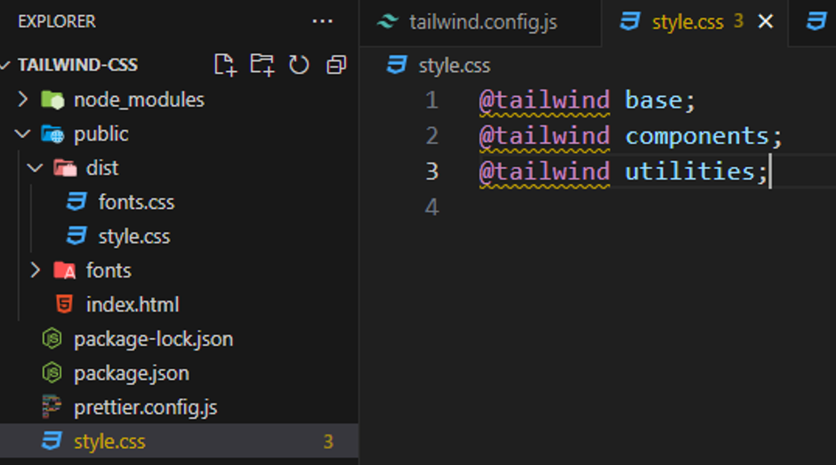

- فصل اول :clipboard:

  - قسمت اول [TailwindCss چیست؟ ](#چیست؟-tailwindCss)
  - قسمت دوم [پیش نیاز های TialwindCss ](#پیش-نیاز-های-TialwindCss)

  - قسمت سوم [Utility ها در تلویند چی هستند ](#ها-در-تلویند-چی-هستند-Utility)

  - قسمت چهارم [آیا تلویند بازدهی سایت رو کم میکنه؟! ](#آیا-تلویند-بازدهی-سایت-رو-کم-میکنه؟!)

  - قسمت پنجم [Tailwind Css در چه وب سایت های استفاده شده ](#Tailwind-Css-در-چه-وب-سایت-های-استفاده-شده)

- فصل دوم :clipboard:

  - قسمت اول [توضیح کلی و نحوه این فصل](#توضیح-کلی-و-نحوه-این-فصل)

  - قسمت دوم [آماده سازی کد ادیتور و اکسیشن های مورد نیاز](#آماده-سازی-کد-ادیتور-و-اکسیشن-های-مورد-نیاز)
  - قسمت سوم [نصب تلویند با استفاده از Tailwind CLI](#نصب-تلویند-با-استفاده-از-Tailwind-CLI)
  - قسمت چهارم [کانفیگ کردن prettir با تلویند](#کانفیگ-کردن-prettir-با-تلویند)
  - قسمت پنجم [نصب تلویند روی فریم ورک های مختلف](#نصب-تلویند-روی-فریم-ورک-های-مختلف)
  
- فصل سوم 
  - قسمت اول [Utility های فونت](#Utility-های-فونت)
  - قسمت دوم [نحوه کلی کارکرد Layer ها و Apply در تلویند](#نحوه-کلی-کارکرد-Layerها-و-Apply-درتلویند)
  - قسمت سوم [نحوه کلی کارکرد فایل Config در تلویند](#نحوه-کلی-کارکرد-فایل-Config-در-تلویند)
    
  - قسمت چهارم بزودی ... :blush: :date:

---

<div align="center">
  
</div>

<br/>

فصل 1- معرفی

> # چیست؟ tailwindCss

_نوشته شده بر اساس دوره تلویندcss با امید بهاری فر سایت [سایت کدنایت](https://codenight.ir/courses)_

کلید یادگیری اینه که یک بار بعد دیدن دوره یا خواندن و یادگیری از حفظ یکبار و چند بار اموخته های خود را کد بزنید

تلویند فریم ورکی برای نوشتن سریع و ساده کد ها و استایل های css است.
تلویند راه حلی به شما میده که بتونیم استایل های css رو به عناصر html رو بدون اینکه از فایل html خارج بشیم اعمال کنیم.
در حالت کلی اگه با سی اس سی خالی بخوایم استایل دهی کنیم باید به عنصرمون یه ایدی یا کلاس بدیم و توی فایل سی اس اس مون اون رو انتخاب کنیم و بهش استایل بدیم هلا ممکنه برای انتخاب اسم clsss یا id درسته براش یه سری قواعد و اصولی رو ابداع کردن ولی باز هم این چالش رو به صفر نمیرسونه حتی گاهن ممکنه اون فایل سی اس اس شما خیلی طولانی شود و دیگه ندونید که از این اسم کلاس یا ایدی استفاده کردین قبلا یا خیر و اگه کلاس های هم نام یا استایل های مشابه داشته باشیم ممکنه تداخل ایجاد کنه و حتی کد های تکرار شده

```html
<div class="container">
  <!-- ... -->
</div>
```

```css
.container {
  background-color: red;
  display: flex;
  justify-content: center;
  height: 100vh;
}
```

###### فرایند استایل دهی سنتی با html , css

<br/>
<br/>

```html
<div class="flex justify-center bg-red-500 h-screen">
  <!-- ... -->
</div>
```

###### استفاده از tailwindCss

هموطور که میبینید برجای اینکه یه کلاس خاص یا ایدی براش درست کنیم و بعدن تو یه فایل سی اس اس دیگه تازه بیاییم بهش استایل هامونو اعمال کنیم اومدیم از کلاس های خاص خود تلویند استفاده کردیم این چهار تاکلاس که نوشتیم درواقع کلاس های خاص تلویند هستند یعنی تلویند این کلاس ها رو در اختیارمون قرار میده

تلویند همه پراپرتی های css به همراه مقادیر اونها رو در قالب کلاس های خاصی توی خودش تعریف کرده و در اختیار ما قرار داده

اینجا منضور تلویند رو متوجه شدیم اینکه توی سایت خودشونم گفته بودن دادن استایل ها بدون اینکه نیاز باشه از کد html خارج بشید.
تلویند برخلاف Bootstrap و MUI استایل و کامپوننت آماده ندارد!

همونطور که دیدیم تلویند فقط میاد نوشتن استایل های سی اس اس رو ساده تر میکنه یعنی همچنان لازمه شما استایل های خودتونو بنویسید . منتها اون شیوه نوشتن و ساده تر میشه اما بوتسترپ و متریال یو آی اینطوری نیستن اینا استایل های از پیش تعین شده و از پیش آماده دارن مثلا خودشون عناصر و استایل های فورم یا نوبار و ... رو دارند و اره شما تاحدودی میتونین اینا رو شخصی سازی کنید اما بیس کار توی اما توی تلویند اینطوری نیست تلونید گقتیم فقط میاد نوشتن کد های CSS رو ساده تر میکنه و عملا ساختار رو مجدد خودتون باید پیاده سازی کنید.

هالا مزیت این قضیه چیه؟
اینه که شما کاملا دستتون بازه به اندازه سی اس اس خام که هر استایلی که میخواید هر دیزاینی که میخواید هر چقدر پیچیده هر چقدر هم حرفه ای با استفاده از تلویند میتونین اون رو پیاده سازی کنید. که خب بوتسترپ و متریال یو ای خیلی جاها دست شما رو میبندند که خب همه اون سایتایی که با بوتسترپ ساخته شده اند یه پسزمینه مشترکی دارند چون بهم شبیه هستند استایل ها شون چون اماده هست و برای متریال یو ای هم به همین شکل
که همه سایت هایی که با تلونید ساخته شده اند همه باهم فرق دارند و باهم متفاوت هستند. چون دست دولوپر بازه

`این قضیه مربوط به برتری تلویند یا متریال یو ای یا بوتسترپ نیست بلکه کاربرد اینا باهم متفاوت است . مثلا یه زمانی هست که شما میخواید یه دیزاین پیچیده و خفنی رو درست کنید لازمه که دستتون باز باشه با پراپرتی های سی اس اس بازی کنید واینجور مواقع تلویند به کارمون میاد 
ولی یه زمانی هست که میخوایم خیلی سریع یه دیزانی رو جمع و جور کنیم که کارو رابندازه و  مثلا سایتمون یه دیزاین ساده میخواد بوتسترپ و متریال یو ای خیلی کاربردی ترن هر کدوم به جای خود.
`

---

> # پیش نیاز های TialwindCss

<br/>

<div align="center">
  

_Html , Css ضروری_

تسلط به زبان نشانه گزاری html ضروری و تسلط به css ضروری

</div>

<div align="center">
  
  

_JavaScrip , Npm مزیته اجباری نیست_

</div>

---

> # ها در تلویند چی هستند Utility

اینکه خود سایت تلویند هم میگه تلویند یه فریم ورک utility-first هست به چه معنی هست. و یوتیلیتی در اختیار کاربرش قرار میده و اجازه میده که ما از این utility های استفاده کنیم و با استفاده از این utility ها استایل خودمون رو به عناصر اعمال کنیم.

تلویند مجموعه ای از یوتیلیتی ها رو در اختیارمون قرار میده مثل کلاس های ریز که هرکدوم کاری انجام میدن و ما میتونیم دونه دونه این کلاس ها که ما بهش میگیم utility رو به عنصرمون بدیم و بتونیم اون استایل نهایی رو روش داشته باشیم .

خب شاید سوالی که به زهنتون برسه این باشه خب اگه همه اون استایل های مثل کلاس هستند چرا نیاییم اتربوت style رو بصورت انلاین بدیم به عناصر و اینطوری استایل ها مون رو اعمال کنیم

```html
<!-- inline style -->
<div style="display: flex; background-color: red;">...</div>
```

```html
<!-- utilitie class tailwindCss -->
<div class="bg-red-500 flex"></div>
```

<br/>

مهمترین دلیلی که این یوتیلیتی کلاس ها بر اینلاین استایل ها برتری داشته باشند اینه که شما در اینلان استایل ها نمیتونین به مدیاکویری ها دسترسی داشته باشید مدیا کوییری منضور همون دیزاین ریسپانسیو است از طریق انلاین استایل ها مقدور نیست اما تلویند طوری طراحی شده که شما میتونین این یوتیلیتی کلاس ها رو درحالت ریسپانسیو هم استفاده کنین
مورد بعدی شما در حالت اینلاین استایل ها نمیتونیم به hover , focuse و ... دستری داشته باشیم مثلا از طریق انلاین استایل نمیتونیم به حالت هاور یه دکمه استایل بدیم ولی باز هم تلویند فکر اینجاشم کرده و برای استایل دهی کردن در حالت هاورهم و سایر... هم سینتکسی داره
یه نکته دیگه شما اگه از انلاین استایل ها استفاده کنید نمیتونید که مثلا یه کد رنگی داخل یک متغیری تعریف کنیم و بعد از اون اسمه متغیر استفاده کنید هر بار اگه خاستین یه کد رنگی بنویسد هربار باید اون رو تایپ کنین ولی خب تلویند این امکان رو به شما میده که یه سری مقادیر رو داخل یه سری متغیر تعریف کنید و دیگه مجبور نشید هر بار اون مقدار رو بصورت دستی تایپ کنیم بلکه بجاش از اسم اون متغیر استفاده کنیم که کارمون راحت تر بشه و بعدن هم اگه خاستیم بصورت کلی اون رنگ یا مقدار رو برای همه عوض کینم خیلی راحت تره
این بصورت کلی برتری یوتیلیتی کلاس ها بر انلاین استایل ها بود
Inline-style , utility-class

---

> # آیا تلویند بازدهی سایت رو کم میکنه؟!

ایا تلویند تاثیر منفی روی سایت میزاره یا مثلا سرعت سایت رو کم میکنه یه سرعت لود سایت رو کم میکنه؟ خیر

تلویند به هیج عنوان پرفورمنس سایت یا سرعت سایت رو کم نمیکنه بهرحال شاید شنیده یا دیده باشید هر پکیجی تاثیر منفی کمی روی پروژه میزاره و این طبیعی و مشخصه
ولی راجب تلویند اینطروی نیست چرا؟
اگه خاطرتون باشه ما از یوتیلیتی های تلویند چند صفحه قبل استفاده کردیم تلویند یه سری یوتیلیتی هایی رو به ما میده که با مجموعه اینا روی هر کدوم از عناصر سایتمون به اون استایل موردنظر میریسیم
هالا نکته ای که وجود داره تریکی که تلویند میزنه اینکه بعد از اینکه فرایند توسعه پروژه ما تموم شد زمانی که خاستیم نسخه نهایی رو استخراج کنیم تلویند تو اون مرحله میاد کل سورس کد اون قسمتی که براش مشخص میکنیم رو میاد اسکن میکنه و برسی میکنه و صرفن اون یوتیلیتی هایی که ما ازش استفاده کردیم رو تشخیص میده یعنی تشخیص میده که ما از کدوم یوتیلیتی ها استفاده کردیم و به عنوان خروجی خودش فقط و فقط یه استایل شیت شامل اون یوتیلیتی هایی که ما ازشون استفاده کردیم اریه میده یعنی تنها یادگاری تلونید روی پروژه هایی که از تلویند استفاده میشه توی خروجی نهایی یه استایل شیت کاملا بهینه از اون یوتیلیتی های تلویندی هست که کاربر ازش استفاده کرده و دیگه بقیه یوتیلیتی هایی که ازش استفاده نکردیم رو توی اون استایل شیتش نمیاره  
و این خروجی سبک و بهینه شده باعث میشه که تلویند هیچ تاثیر منفی روی پرفورمنس سایت نزاره و حتی این فایل استایل شیتی که تلویند تو خرجی بهون میده از استایل شیت روش سنتی که قبلا مینوشتیم خیلی وقتا بازدهی بیشتر و بهتری داره به این علت که اولا کد تکراری نداره و خب هرکدوم یوتیلیتی های داخلش هم چند باز مصرف هستن به همین دلیل نه تنها پرفورمنیس سایتمون رو بدتر نمیکنه بلکه ممکنه در برخی موارد بهنیه ترم است.

---

> # Tailwind Css در چه وب سایت های استفاده شده

<br/>

وب ساست open ai هوش مصنوعی چت جی پی تی.

<div align="center">
  
  
  Openai.com
</div>

<br/>

وب سایت دات نت که برای شرکت مایکروسافت است.

<div align="center">
  
  
  Dotnet.microsoft.com
</div>

<br/>

وب سایت next.js

<div align="center">
  
  
  nextjs.org/docs
  
</div>

<br/>

وب سایت کد نایت

<div align="center">
  
  
  codenight.ir
</div>

---

فصل دوم : نصب تلویند وآماده سازی محیط توسعه در فریم وک های مختلف

> # توضیح کلی و نحوه این فصل

توی این فصل اکستیشن ها و مواردی که توی کد ادیتور مون نیاز داریم میپردازیم ونصب میکنیم و اگه نرم افزاری روی کامپیوترمون لازم است نصب میکنیم. و درقدم بعدی تلویند رو به پروژه خودمون اضافه میکنیم.

نکته ای که هست ما توی طول این دوره تلویند رو روی html , css خالی نصب و کار میکنیم . اما اگه خودتون به فریم ورک های دیگه مثل react , next , nuxt ,… تسلط دارید اموزش نصب تلویند روی اون ها هم هست توی داکیومیشن اصلی تلویند و توی دوره
پس ما تلویند رو روی پروژه خالی html , css نصب میکنیم tailwind CLI رو نصب میکنیم .
البته که کارکرد تلویند روی css , html خالی با فریم ورک های js فرقی نداره فقط فرایند نصبشون یکم باهم فرق دارند
از طریق سایت خود تلویند قسمت داکیومیشن و قسمت نصب میتونین نصب تلویند و دستورات نصب روی فریم ورک های مختلف رو میتوینن نصب کنین
1- وارد وب سایت tailwindcss.com
2- از منوی بالا وارد بخش DOC بشین داکیومیشن
3- از منوی سمت چپ روی Getting Start بشن صفحه ای که براتون میاد هم یه منو داره روی Framework Guids بشن و لیست لایبری ها و کتاب خانه ها

https://tailwindcss.com/docs/installation/framework-guides

<div align="center">
  
  
  
</div>
---

> # آماده سازی کد ادیتور و اکسیشن های مورد نیاز

اکسیشن های کاربردی
Tailwind CSS IntelliSense
که خود تلویند اون رو برای vscode توسعه داده و پیشنهاد اینه که اگه از تلویند داخل پروژه تون استفاده میکنین این extensons رو نصب کنین که راحتر و سریعتر کد بزنین

 

کاری که این اسیشن برای ما انجام میده میاد یوتیلیتی های تلویند رو موقع کد نویسی برای ما پیشنهاد میکنه یعنی دیگه ما لازم نیست همه یوتیلیتی ها ی تلویند رو حفظ باشیم یه ذره شو که بنویسیم خودش کاملشو پیشنهاد میده

اکستیشن دوم prettier-Code formatter است


کاری که این اکستیشن انجام میده اینه که کد های شما رو مرتب میکنه و نتضم میده که کد های تلویندی و ساختار html , ….. رو هم منظم میکنه که کد های تر تمیز تری میکنه.
که با کلید های ترکیبی alt + shift + f عمل میکنه.

همچنین نرم افزاری که نیاز هست برای نصب و راهندازی تلویند نرم افزار


است nodeJs

---

> # نصب تلویند با استفاده از Tailwind CLI

ما وقتی میخوام تلویند رو به پروژه html , css خام خود نصب کنیم از tailwind css CLI استفاده میکنیم .
بعنی تنها راه مطلوب و درست حسابی استفاده از این تلویند سی اس ای است
خب ما وارد ادرس و وب سایت tailwindcss.com میشویم وارد بخش DOC میشیم و توی بخش installation روش نصب با استفاده از tailwind CLI رو نوشته

برای اینکه بخوایم tailwind cli  رو نصب کنیم  ابتدا لازمه که npm  رو وارد پروژه کنیم که بخاطر همین بود که در جلسه های اول اومدیم و نود جی اس رو نصب کردیم  npm رو که نصب کردیم پکیج هایی که نصب میکنیم تویه قسمت و یه بخش اسم هاشون است
وارد ترمینال و مسیر پروژه میشیم فرض کیند که یه پوشه به اسم tailwind-cli  رو داریم با ترمینال یا cmd  و یا getbash وارد اون مسیر پوشه ای که درست کردیم میشم و  npm  رو نصب میکنیم با دستور 
npm init 
که این دستور حاصل از اون نرم افزار نود جی اس است که جلسه های پیش نصب کردیم اون این دستورات  npm  رو برای ما باز میکنه وقتی این دستور رو زدیم خود نود جی اس شروع به افزودن npm  به پروژه یا پوشه ما میکنه
البته موقع نصب  npm یه سری سوالات ازمون میپرسه که اونا رو رد میکنیم مثل اسم پروژه و ورژنش چیه توضیحات و ... اسم نویسنده پروژه ویه سری سولات
ها لا یه فایل به اسم و پسوند pacage.json   به پوشه ای که ساختیم اضافه میشه 
هالا ما هر پکیج و یا کتاب خانه ای با  npm  نصب کنیم اسمش و ورژن و اطلاعاتش میاد تو این فایل 

خب هالا بریم که تلویند سی ال ای رو نصب کنیم با  npm 
```
npm install -D tailwindcss 
```
وقتی که این دستور رو بزنیم یه فولدر node_modules  اضافه میشه که وابستگی های پروژه تلویندی ما هست و یه فایل pacage-lock.json  هم اضافه میشه  و همجنین داخل اون فایل pakage.json  مون هم یه قسمت "devDependencies" که داخلش نوشته شده   "3.3.7":"tailwindcss" اسم پکیجی که نصب کردیم و ورژن اون هست . 


پس اینطوری شد که یه فایل css  توی مسیر روت پروژه به عنوان فایل  style.css ورودی تلویندی داریم و یه فایل style.css هم برای خروجی استایل های یوتیلیتی خروجی تلویند داریم که مثلا تو فولدر public میایم یه پوشه درست میکنیم مثلا به اسم dist    ویعنی فایل های نهایی رو اونجا قرار میدیم و این قایل style.css  خروجی تلویندی رو هم اونجا قرار میدیم.


حلا کاری که انجام میشه اینه که ما توی فایل  ``` index.html ``` مون برای عناصر هر یوتیلیتی که بنویسم تلویند میاد داخل فایل کانقیگیمون اون مسیر رو که مشخص کردیم اون فایل ```index.html``` رو یوتیلیتی ها رو اسکن میکنه  و درنهایت اون یوتیلیتی هایی که استفاده کردیم رو توی اون فایل خروجی  style.css مون مینویسه 
هلا بعدن که خواستیم مثلا این پروژه مون رو ببریم رو سرور این فایل های html  و اون ```style.css``` خروجی رو میبریم رو سرور و تمام 
هلا قبل از اینکه این کار رو انجام بدیم لازمه که توی استایل شیت ورودی تلویند لازمه که directives های تلویند رو اونجا اضافه کنیم که توی سایت هم نوشته 


اینا directives  های تلویند هستند تلویند استایل های مورد نیاز ورودی خودشو از طریق این دایریکتیو ها  بصورت خودکار میگیره  این صرفن ورودی تلویند هست تنها چیزی که برای مرورگر قابل درکه و مهمه ایون style.css خروجی که تو پوشه dist ساختیم هست و خودش خودکار میاد این ورودی ها رو تبدیل میکنه به یه چیزی که مرورگر بفهمه  واونا رو تو فایل خروجی میریزه
وتمام الان همه کانفیگ های مورد نیاز ما انجام شد و میتونیم فرایند تبدیل کردن  رو استارت بزنیم یعنی به تلویند بگیم تو از الان دیگه گوش برزنگ باش  و هر کدی هر یوتیلیتی که تو اون فایل index.htl نوشتیم رو  تو بیا اونایی که استفاده کردیم تو این فایل  ورودی style.css اونا رو بگیر و تو خروجی  style.css  درست کن هالا چطوری میتونیم این کارو انجام بدیم؟
```
 npx tailwindcss -i style.css -o public\dist\style.css –watch
```
این کامند چیکار میکنه  ```npx tailwindcss``` میگه تو بیا استارت بخور ```-i``` میگه به عنوان وردی این مسیر رو در نظر بگیرورودی ها اینه دایریکتیو ها تو اینه و ```-o``` خروجی ها 	یعنی خروجی کارتو بریز اینجا  و همچنین این فرایند رو 
--watch کن یعنی حواست باشه نگهدار این فرایند روهردفه که سورس کد تغیری کرد تو  بیا یه دور دیگه این کارو انجام بده یعنی این –watch به ما این امکان رو میده که بصورت لایو زنده هرتغیری که تو فایل ```index.html``` هرتغیری یا یوتیلیتی مینویسیم و اضافه میکنیم این دباره اجرا میشه و لازم نیست با هر تغیر و افزودن یوتیلیتی جدید دباره این دستور رو هی بزنیم .
خب با این دستور خروجی استایل شیت مون درست میشه .

وقتی اولین باز این دستور رو میزنیم 
```npx tailwindcss -i style.css -o public\dist\style.css –watch```

تو اون فایل خروجی استایل شیت حدودن 500 خط کد اضافه میشه که در واقع کد های پایه ای  کد های مربوط به استایل های بیسیک تلویند است که اینا رو اضافه میکنه تا من محیط توسعه م بهتر بشه  یه سری چیزا مثلا مارجین های دیفالت رو صفر کرده پدینگ های دیفالت رو صفر کرده  و.. 


خب هالا که مطمن شدیم و همه کانفیگا و فایل ها مونو درست کردیم و اماده شروع کار و استفاده از تلویند هستیم.
برای مثال اولین یوتیلیتی رو مینویسم که ببینیم تلویند درست کار میکنه یا نه 


بعدن با این یوتیلیتی ها اشنا میشیم این فقط یه مثال بود که ببنیم کار میکنه
خب میتونیم بجای اینکه هر بار موقع اجرا کردن یا وقتی پروژه رو کلا میبندیم و باز میکنیم هی این دستور رو بزنیم یه کاری کنیم که راحت تره 

برای اینکار کافیه وارد فایل pacage.json بشیم و داخل بخش "script"
میتونیم یه مثلا دستور ایجاد کنیم و یه اسم براش قرار بدیم 


---

> # کانفیگ کردن prettir با تلویند


توی این جلسه قراره که قبلا که اکستیشن  prettierرو نصب کردیم و فهمیدیم که مختص به فقط تلویند هم نیست بصورت کلی روی کد ادیتور ما نصب میشه و کد ها رو با زدن کامد کلید های ترکلیبی مرتب میکنه .
خب ما میدونیم که تلویند با استفاده از نوشتن یوتیلیتی هاش به عنوان کلاس  روی هر عنصر برای ما کار میکنه خب ما میدونیم که درحالت عادی یوتیلیتی های تلویند رو با هر ترتیبی که میخوایم برای عناصرمون بنویسم .
درست تره که اون یوتیلیتی هایی که دراینده هم بهاشون اشنا میشیم بر اساس یه نظم و ترتیبی باشن .
البته هیچ الزامی وجود نداره ولی خب کار درست تر و قشنگ تره که با یه نظمی به ترتیب نوشته بشه و خود سایت تلویند هم اون رو توصیه کرده

https://tailwindcss.com/blog/automatic-class-sorting-with-prettier#how-classes-are-sorted

که توی این لینک هم یهش اشاره کرده یه مقاله ای نوشته که بهتره یه نظمی رور رعایت کنیم که کد تمیز تر و اسولی تر و خوانا تری رو داشته باشیم .

ولی خب اگه ما خود مون هی حواسمون به این موضوع باشه و هی کدمون رو چک کنیم یکم اذیت کننده است که ایا این یوتیلیتی ها رو با نظم نوشتیم یا نه 

کاری که prettier در کنار تلویند برای ما انجام میده علاوه بر نظم دهی به عناصر مون  utility های مونم مرتب میکنه برای اینکار لازمه که یه کانفیگ و تلویند رو به  پلاگین  prettierبشناسونیم  تا این utility  ها رو هم مرتب کنه 
با کامند alt + shift + f  برای اینکار و کانفیگ کردن این قابلیت از طریق یه پلاگین که روی پلاگین prettier نصب میشه . یه نکته خود پلاگین prettier میتونه یه سری پلاگین های دیگه ای رو هم روش نصب کرد که هرکدوم از اونها قابلیت هایی جدید رو بهش اضافه کنند  وارد سایت تلویند میشیم 


که اگه روی on GitHub کلیک کنیم وارد یه اکنت گیت هاب میشیم
که لینکش اینه 

https://github.com/tailwindlabs/prettier-plugin-tailwindcss

اسمش pretteier-plugin-tailwindcss است 
و دستورات نصب و کانفیگ و توضیحالتش یکم پایین تر نوشته شده


```
npm install -D prettier prettier-plugin-tailwindcss
```

خب هالا این پلاگین روی اکستیشن prettier نصب شد و یه مرحله دیگه داریم  . بازمه که یه فایل با اسم prettier.config.js  درست کنیم رو مسیر روت پروژه
و داخل فایل prettier.config.js این کد رو قرار بدیم 

``` html
module.exports = {
  plugins: ['prettier-plugin-tailwindcss'],
}
```

و این تنظیمات رو داخلش بنویسم  و درواقع یه prettier  گفتیم که  تو بیا از پلاگین prettier-plugin-tailwindcss استفاده کن .


خب هالا میتونیم از این قایلیت های مرتب سازی کد ها المنت ها و یوتیلیتی های تلونیدی رو هم مرتب کنه و نظم بده .
یه مثال بزنیم:


خب هالا کلید های ترکیبی  ali+ shift + f رو میزنیم 


---

> # نصب تلویند روی فریم ورک های مختلف


ما میتونیم تلویند رو روی فریم ورک های مختلف نصب کنیم. برای درک این موضوع و یاد گیریش وارد وب سایت تلویند میشیم  وارد قسمت DOC  میشیم واز ناوبار قمست Getting Started  و Instalation

<div align="center">
  
  
</div>
روی هرکدوم که کلیک کنین روش های نصبش رو توضیحاتی داده مثلا ریکت رو یه توضیحات مختصر میدمیم درموردش

توی قدم اول بعد نصب ریکت با دستور 

```
npm install -D tailwindcss
```

```
npx taiwindcss init
```

میبینیم که فایل ` tailwind.config.js `  خودش درست شده و لازم نیست که بصورت دستی اون رو درست کنیم.
داخل اون فایل تلویند کانفیگ کانفیگ و مسیر خواندن و اسکن کردن فایل ها رو میزرایم


توی پروژه ریکتی چون فایل ها توی پوشه src هستند و همه کامپوننت هایی که درست میکنیم توی این پوشه هستند پس تنها جایی که لازمه ادرس بدیم همینجا هست وارد اون پوشه شده و گفته همه پوشه و فایل هایی که همه اونایی با پسوند های  js,jsx,ts,tsx  هستند رو اسکن کن  

مرحله بعد اضافه کردن directives  های  استایل شیت ورودی هست که توی پروژه ریکتی معمولا میازاریم تو همون فایل css نقطه شروع پروژه که فایل index.css است .


index.css
``` css
@tailwind base;
@tailwind components;
@tailwind utilities;
```

دیگه لازم نیست استایل شیت خروجی بسازیم یا نقطه ورود مسیرشو رو بنویسم کدوم فایل هست و نقطه خروجی کجا هست و... خود کتاب خانه ها این رو هندل میکننند
حالا اگه ریکت رو با روش creacte-react-app  درست کردیم با کامند npm start اون رو راهندازی میکنیم و چند utility مینویسیم  .
و کار میکنه .


---


> # Utility های فونت

فصل 3 - مفاهیم و utility  های پایه ای

<br/>

بصورت پیشفرض خود تلویند فقط سه تا utility  برای فونت ها داره و سه نوع فونت رو در اختیار ما قرار میده که درواقع همون فونت های دیفالت خود مرور گر هستند که توی پروژه های واقعی این سه utility فونت برای ما کاربرد ندارند چون شاید ما بخوایم فونت دلخواه خودمون رو داشته باشیم  و فونت های فارسی داشته باشیم	.

در طول این فصل یاد میگیریم که utility های دیفالت تلویند رو تغیر ویا افزایش بدیم واضافه کنیم 


که توی وب سایت تلویند هم قسمت Typogrophy و بخش Font Family هم این سه تا یوتیلیتی فونت ها رو نوشته  

https://tailwindcss.com/docs/font-family


| Class      | Properties |
| ----------- | ----------- |
| font-sans      | font-family: ui-sans-serif, system-ui, sans-serif, "Apple Color Emoji", "Segoe UI Emoji", "Segoe UI Symbol", "Noto Color Emoji";       |
| font-serif	   | font-family: ui-serif, Georgia, Cambria, "Times New Roman", Times, serif;        |
| font-mono	   | font-family: ui-monospace, SFMono-Regular, Menlo, Monaco, Consolas, "Liberation Mono", "Courier New", monospace;        |


---

> # نحوه کلی کارکرد Layer ها و Apply در تلویند

اینا مربوط به همون استایل شیت ورودی هستند . اگه خاطرتون باشه چندین بار اون استایل شیت ورودی تلویند و اون سه تا دایریکتیو (directives) اشاره کردیم


@tailwind base:


```css
@tailwind base;
@tailwind components;
@tailwind utilities;

```

که الان توش عمیق میشیم و داستانش چیه رو باهم برسی میکنیم و کلا این دایریکتیو ها(directives) چیه و چه مزیت و امکانی رو دراختیارمون قرار میدن.

اگه استایل شیت خروجی تلویند رو یه نگا بندازیم میبینیم که 500 و خورده ای خط کد هستش و این حاصل directive @tailwind base; است.
هلا این دایریکتیو base چیه؟  تلویند با قرار دادن این دایریکتیو base درواقع میاد همه استایل های  بیسیکی که برای خونثا کردن استایل های دیفالت مرور گر ها است رو  توی استایل شیت خروجی قرار میده . پس با نوشتن این @taiowind base; توی استایل شیت ورودی تلویندی مییاد یه سری استایل هایی رو برای غیرفعال کردن یا خنثا کردن داخل استایل شیت خروجی میزاره تا استایل های پیشفرض عناصر رو بگیره
@tialwind utilities : 
Directive utilites چیه و چیکار میکنه؟ زمانی که شما این دایریکتیو رو به پروژه فایل استایل شیت ورودی اضافه میکنید میگید همه یوتیلیتی های تلویند رو توی استایل شیت ورودی لود کن ولی زمانی که خاستی استایل شیت خروجی رو بسازی  بیا کدای منو اسکن کن مثلا اون فایل ها و پسوند هایی که براش مشخص کردیم که برای مثال فایل  index.html  و صرفن فقط اونایی که استفاده کرده بودم رو اونا رو فقط توی استایل شیت خروجی بزار 

@tailwind components :
این دایریکتیو در حالت عادی  و دیفلت خالیه
پس برای چی گزاشتن؟ ما میتونیم استایل های مورد نظر خودمون رو به هر کدوم  از دایریکتیو ها که میخوام اضافه کنیم  یعنی میتونیم بگیم تلویند زمانی که تو داری استایل های دایریکتو مثلا base رو دار اضافه میکنی  بیا این چند تا استایلی که من بهت میگمم اضافه کن  یا تلویند من میخوام یه سری یوتیلیتی جدید به پروژم میخوام اضافه کنم و بیا این یوتیلیتی هایی منم بشناس و با یوتیلیتی های خودت بشناس و درنطر بگیر 

البته هرکدوم از اینها از انها که میتونیم استایل های خودمون رو بهشون اضافه کنیم شرایط خودشون رو دارند و یه سری تفاوت هایی هم باهم دارند.

` برای اینکه شما بتونین موارد و استایل های مورد نظر خودتون رو به هرکدوم از این directive ها اضافه کنین لازمه که از سینتکس  @layer و اسم دایریکتیو. `

```css
@tailwind base;
@tailwind components;
@tailwind utilities;

@layer base {

}

@layer utilities {

}

@layer components {

}
```

داخل اینا هر قطعه کد و استایلی که داخل هر کدوم از اینها بنویسیم همزمان با اطلاعات  مربوط به هرکدوم از این دایریکتو ها داخل استایل شیت خروجی  تلویند قرار میگیره.

هالا فرقاشون باهم چیه؟
همه استایل هایی که شما داخل @layer base اضافه میکنیم تحت هر شرایطی داخل استایل شیت خروجی تلویند قرار میگیرند چه از ش استفاده کنیم چه نکنیم دقیقن مثل همون استایل های بیس تلونید 

استایل شیت ورودی دایریکتیو ها ی تلویند

```css
@tailwind base;
@tailwind components;
@tailwind utilities;

@layer base {
    div {
        display: inline-block;
    }
}

@layer utilities {

}

@layer components {

}
```

استایل شیت خروجی  تلویند


پس شما وقتی که میخواید یه سری استایل هایی رو به عناصر اصلی بدید مثل همه div  ها یا همه عناصر  img ها  یا یه همچین چیرایی میتونین از @layer base اسفتاده کنید دقت کنین که از کلاس ها و ایدی ها اینجا نمیتونیم اینجا بهشون استایل خودمونو بدیم . این layer فقط برای تگ ها است . پس استایل های پایه ای تگ ها رو میتونیم اینجا قرار بدیم.

شاید براتون سوال پیش باید که مثلا اگه اون استایل و سلتور ها رو برون از این layer ها بنویسم چی؟ خب این استایل ها اعمال میشن ولی دیگه تلونید نمیتونه روش کنترولی داشته باشه یه جورایی نمیتونه خدمات خودشو رواون استایل بهمون بده  هالا چه خدماتی؟ جلوتر بهاشون اشنا میشیم.

Layer بعدی  @layer utilites : 
هر استایلی که ما داخل این layer   قرار بدیم و بنویسم دقیقن مثل یک یوتیلیتی تلویندی خواهد بود و تلویند مثل یک یوتیلیتی خودش بهاش برخود میکنه  یعنی چی ؟  یعنی در قدم اول اون رو تو استایل شیت خروجی تلویند نمیزاره تا زمانی که ما ازش استفاده نکنیم. 


مثلا یکی از یوتیلیتی هایی که میخوایم به تلویند اضافه کنیم و تلویند اون رو نداره حذف اسکرول بار هستش

```css
@tailwind base;
@tailwind components;
@tailwind utilities;

@layer base {
    div {
        display: inline-block;
    }
}

@layer utilities {
    .hede-scrool::-webkit-scrollbar {
        display: none;
    }
    .hede-scrool {
        -ms-overflow-style: none;
        scrollbar-width: none;
    }
}

@layer components {

}
```
خب الان تونستیم این یوتیلیتی رو به تلونید اضافه کنیم و تلویند مثل یک یوتیلیتی بهاش برخورد میکنه و الان تو استایل شیت خروجی تلویند نیست مگر تا زمانی که ازش استفاده کنیم.


@layer components هم شبیه layer utilites است یعنی اگه که ازش استفاده نکرده باشین تو استایل شیت خروجی تلویند اون رو نمیاره ولی فرقش یا layer utilites چیه؟  این layer components معمولا برای  تعریف کردن کلاس هایی یا یوتیلیتی هایی است که شامل چند تا استایل پراپرتی است یعنی توی layer utilites ما هر چند تا کلاس یوتیلیتی که تعریف میکردیم شامل یک پراپرتی سی اس اس استایل بود اما تو layer components  ما میتونیم کلااس هایی رو تعریف کنیم که شامل چندین پراپرتی سی اس اس میشن و مثلا کجا استفاده میشن مثلا یه کلاسی تعریف کنیم که اون کلاس یا یوتیلیتی رو به هر عنصری دادیم اون عنصر هم بک گراند رنگ قرمز و هم یه بوردر ریدیوسی بگیره و مثلا هم یه بوردیر 1پیکسلی هم بگیره یه همچین جور جاهایی که میخواید چندیین استایل رو یکی کنیم   و درقالب یک کلاس یا یوتیلیتی ازش استفاده کنیم توی این layer components هم تا زمانی که ازش استفاده نکنیم تو استایل شیت خروجی تلویند قرار نمیگیره .


```css
@tailwind base;
@tailwind components;
@tailwind utilities;

@layer base {
    div {
        display: inline-block;
    }
}

@layer utilities {
    .hede-scrool::-webkit-scrollbar {
        display: none;
    }
    .hede-scrool {
        -ms-overflow-style: none;
        scrollbar-width: none;
    }
}

@layer components {
    .card {
        background-color: red;
        border: 1px;
        border-radius: 10px;
    }
}
```

همونطور که دیدیم چند استایل رو تو یه کلاس یا یوتیلیتی نوشتیم .
التبه که داخل layer components هم میشه  که یه استایل رو نوشت و بهمون گیر نمیده ولی معمولا همنطور که توضیح دادیم چنیدن استایل رو مینویسیم 

یه نکته مهم : اون کلاس یا یوتیلیتی که توی layer components  مینوسیم اولویت کمتری دارن به نسبت layer ustilites  برای مثال اگه شما background-color : red ; رو داخل یه کلاس به اسم  .red توی layer components بنویسیم و توی layer utilites  هم یه کلاس به اسم مثلا .blue داشته باشیم و توش نوشته باشیم background-color: blue و هردو کلاس ها رو یعنی blue , red رو بدیم به یه عنصر مال layer utilites که رنگ blue هست اعمال میشه در نهایت. چون اولیوت بیشتری داره .

```css
@layer utilities {
    .blue {
        background-color: blue;
    }
}

@layer components {
    .red {
        background-color: red;
    }
}
```


```  پس ولویت استایل هایی که تو layer utilites قرار میگیرن از اولویت استایل هایی که تو layer components  قرار میگیرن بیشتره و همچنین اولویت استایل هایی که تو layer base قرار میگیرند از اولویت استایل های layer utilites بیشتره  ```


Apply
Applay  چیه و چیکار میکنه؟ میاد میگه که اقا تو اگر که خاستی میتونی داخل این استایل شیت ورودی تلویندت بجای اینکه دستی استایل ها  و پراپرتی های سی اس اس  رو بنویسی  میتونی از یوتیلیتی های خود تلویند استفاده کنی 

```css
@tailwind base;
@tailwind components;
@tailwind utilities;

@layer base {

}

@layer utilities {
    .blue {
        background-color: blue;
    }
}

@layer components {
    .red {
        @apply bg-red-500 rounded-sm
    }
}
```


پس شما اگه خاستین داخل layer ها تون بجای دستی نوشتن پراپرتی های css میتونین از @apply استفاده کنین .

---

> #  نحوه کلی کارکرد فایل Config در تلویند


قبلا برسی کردیم که هرپروژه ای که از تلویند استفاده میکنه یه فایل `tailwind.config.js` داره که تنظیمات کلی تلویند داخل اون انجام میشه

اولین کاربردش رو اگه خاطرتون باشه یادگرفتیم اون قسمت "content"  اونجایی بود که ما میومدیم و اون فایل ها و پسوند هایی رو مینویسم تا اونا رو اسکن کنه و یوتیلیتی هایی که تو این فایل ها و فولدر ها استفاده کردیم رو در بیاره و استایل شیت خروجی شو بسازه 


::: warning
*here be dragons*
:::


**این فایل کانفیگه علاوه بر این کاربرد های دیگه ای رو هم داره
بصورت کلی این فایل کانفیگ برای کانفیگوریشن و تغیر دادن کانفیگ ها و مقدار و خود یوتیلیتی های دیفالت تلویند است .

یعنی اگه یه یوتیلیتی توی تلویند است که شما میخواید مقدار اون رو اوررایت تغیر دهید  حتی اگه خاستین یوتیلیتی های جدیدی رو هم اضافه کنین  یا درواقع مقدار جدیدی برای یوتیلیتی های تلونید اضافه کنین باز هم میتونیم از این فایل استفاده کنیم**

